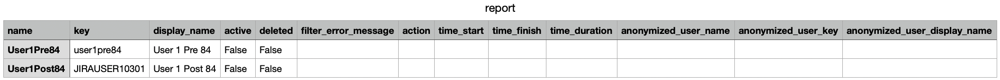
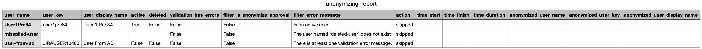
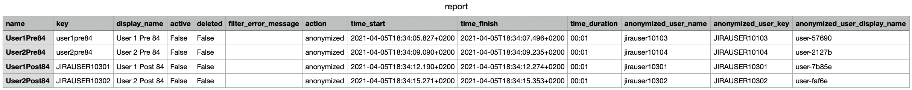

README
=

Other articles

- [Atlassian: Anonymizing users](https://confluence.atlassian.com/adminjiraserver/anonymizing-users-992677655.html)
- [Atlassian: Retrying anonymization](https://confluence.atlassian.com/adminjiraserver/retrying-anonymization-992677663.html)
- [Me: How anonymizing works with the Jira-UI](doc/How_anonymization_works_with_the_Jira-UI.md)
- [Me: About user-names and user-keys](doc/About_user-names_and_user-keys.md)

User Manual
=

- [Quick-start](#quick-start)
- [Command Line Options](#command-line-options)
    * [Overview](#overview)
    * [Details about some options](#details-about-some-options)
        + [--info](#--info)
        + [--infile and --encoding](#--infile-and---encoding)
        + [--try-delete-user](#--try-delete-user)
- [How the Anonymizer works](#how-the-anonymizer-works)
- [The reports](#the-reports)
    * [Overview](#overview-1)
    * [The status printed to the command line](#the-status-printed-to-the-command-line)
    * [anonymizing_report.json](#anonymizing-reportjson)
- [The commands in detail](#the-commands-in-detail)
    * [Command `validate`](#command--validate-)
        + [Example 1: Validation succeeded, no validation error](#example-1--validation-succeeded--no-validation-error)
        + [Example 2: Validation failed for several reasons](#example-2--validation-failed-for-several-reasons)
    * [Command `anonymize`](#command--anonymize-)
        + [Example 3: Anonymization without errors](#example-3--anonymization-without-errors)
- [Known issues](#known-issues)
    * [Validation error-messages in unexpected language](#validation-error-messages-in-unexpected-language)

The Anonymizer is a Python3-script to help Jira-admins anonymizing Jira-users in bulk.

All information stated here is about Jira Server and Jira Data Center. Jira Cloud is not considered yet.

# Quick-start

- Create the file `usernames.txt` with the user-names to be anonymized, one user-name per line.
- Create a config-file-template: `anonymize_jira_users.py misc -g`. The file `my-blank-default-config.cfg` has been
  created.
- Rename the file, e.g. to `my-config.cfg`.
- In that file, set the attributes `jira_base_url`,
  `jira_auth` with format `Basic admin:admin`, `new_owner`.
- Call `anonymize_jira_users.py validate -c my-config.cfg` to see what would happen in case of anonymizing.
- Call `anonymize_jira_users.py anonymize -c my-config.cfg` to execute anonyization.
- Have a look at the report `anonymization_report.csv`. More details about the users are given
  in `anonymization_report_details.json`

# Command Line Options

## Overview

You may call the Anonymizer with preceding `python`. Assure it is Python3.

Documentation is also available through the command line help -h.

The Anonymizer has the three commands `validate`, `anonymize`, and `misc`. These commands have different lists of
options.

Parameter without command:

    --version             show program's version number and exit

Parameters for commands `validate`, `anonymize`, `misc`:

    -l {DEBUG,INFO,WARNING,ERROR,CRITICAL}, --loglevel {DEBUG,INFO,WARNING,ERROR,CRITICAL}
                        Log-level. Defaults to INFO.

Parameters for commands `validate`, `anonymize`:

    -c CONFIG_FILE, --config-file CONFIG_FILE
                          Config-file to pre-set command-line-options. You can
                          generate a config-file-template with option 'misc -g'.
                          There are parameters in the config-file not present on
                          the command line. Empty parameters in the config-file
                          are ignored. Parameters given on the command line
                          overwrite parameters given in the config-file.
    --info                Print the effective config, and the character-encoding
                          Python suggests, then exit.
    -b JIRA_BASE_URL, --jira-base-url JIRA_BASE_URL
                          Jira base-URL.
    -u ADMIN_USER_AUTH, --jira-auth ADMIN_USER_AUTH
                          Admin user-authentication. Two auth-types are
                          supported: Basic, and Bearer (starting with Jira
                          8.14). The format for Basic is: 'Basic <user>:<pass>'.
                          The format for Bearer is: 'Bearer <token>'.
    -i INFILE, --infile INFILE
                          File with user-names to be anonymized or just
                          validated. One user-name per line. Comments are
                          allowed: They must be prefixed by '#' and they must
                          appear on their own line. The character-encoding is
                          platform dependent Python suggests. If you have
                          trouble with the encoding, try out the parameter '--
                          encoding'.
    --encoding ENCODING   Force a character-encoding for reading the infile.
                          Empty means platform dependent Python suggests.
    -o OUT_DIR, --out-dir OUT_DIR
                          Output-directory to write the reports into. If you'd
                          like the date included, give something like `date
                          +%Y%m%d-%H%M-anonymize-instance1`. Defaults to '.'.
    --expand-validation-with-affected-entities
                          Include 'affectedEntities' in the validation result.
                          This is only for documentation to enrich the detailed
                          report. It doesn't affect the anonymization.

Parameters for command `anonymize`:

These parameters extend the above parameters (`validate` doesn't have a specific parameter-list).

    -n NEW_OWNER, --new-owner NEW_OWNER
                          Transfer roles of all anonymized users to the user
                          with this user-name.
    -d, --try-delete-user
                          Try deleting the user. If not possible, do anonymize.
    -D, --dry-run         Finally do not delete nor anonymize. To get familiar
                          with the script and to test it.
    -x, --background-reindex
                          If at least one user was anonymized, trigger a
                          background re-index.

Parameters for command `misc`:

    -g [CONFIG_TEMPLATE_FILE], --generate-config-template [CONFIG_TEMPLATE_FILE]
                          Generate a configuration-template. Defaults to my-
                          blank-default-config.cfg.
    --recreate-report     Re-create the reports from the details file. Only for
                          development.

## Combination of parameters from the conig-file and the command-line

The Anonymizer has up to three places where configurations could exist:

1. The internal default-configuration.
2. Your settings from the config-file (which overwrites the internal default-configuration).
3. Your parameters given on the command line (which overwrites the settings from the config-file).

The anonymizer builds an effective configuration from the above configurations.

You can combine parameters from a config-file and the command-line. E.g. if you don't want your auth-settings stay in a
file (because you like to check-in this), you can set them at the command-line using shell-variables:

    export MY_USERNAME=admin
    export MY_PASSWORD=admin
    anonymize_jira_users.py validate -c my-config.cfg -u "Basic $MY_USERNAME:$MY_PASSWORD"

## Details about some options

### --info

Print the effective config and the character-encoding Python suggests, then exit.

You can combine this parameter with parameters of `validate` and `anonymize`
If `--info` is given in these cases, these commands won't be executed.

### --infile and --encoding

Dependent on how and where the infile is created, you could come into trouble with the encoding. You can possibly fix
this with an explicit character-encoding. To get an idea what Python suggests on your current platform, execute

`anonymize_jira_users.py validate --info`.

This will print something like

`getpreferredencoding UTF-8, getfilesystemencoding utf-8`.

On Windows, this could be

`getpreferredencoding cp1252, getfilesystemencoding utf-8`

Then give the `cp1252` to the next run:

`anonymize_jira_users.py validate --encoding cp1252 <your options goes here...>`

or play around with other encodings.

### --try-delete-user

If is set to `false`, the users will be anonymized. But with set to `true`, the Anonymizer _tries_ to delete users. If
deletion failed for a specific user, this user will be anonymized. The reports show what finally happened to each user.

# How the Anonymizer works

The Anonymizer executes the following steps for the `validation` and the `anonymization` command:

- Parse and check the command line parameters.
- Read the user-names from the infile.
- For each user: Get user-data from
  the [Jira user REST-API](https://docs.atlassian.com/software/jira/docs/api/REST/8.13.2/#api/2/user-getUser). This is a
  check if a user exists.
- For each user: Get validation data from the
  [Jira Anonymization REST API](https://docs.atlassian.com/software/jira/docs/api/REST/8.13.2/#api/2/user/anonymization)
  .
- For each user: Filter against criteria if the user shall be anonymized or not, and store an
  'anonymization approval'.

If the command `anonymize` is called, additionally to the steps above:

- For each user: Run user-anonymization for each user with an 'anonymization approval'
  with [Jira Anonymization REST API](https://docs.atlassian.com/software/jira/docs/api/REST/8.13.2/#api/2/user/anonymization)
  . Transfer ownership to the user given in `--new-owner`.

And finally in both cases `validation` and `anonymization`:

- Create the anonymization-reports.
- Print out a status.

The validation is a subset of the anonymization. So validation is done any time the anonymization is done. With
validation only you can get an impression what would happen in case of anonymization.

The filter-criteria to not delete or anonymize (= to skip), and their filter--error-messages are:

- The user isn't existent: `The user named 'user-1' does not exist`
- The user is active: `Is an active user.`
- The validation REST API didn't return 200: `HTTP status-code of the REST validation API is not 200.`
- The validation REST API returned 200 with validation-error-message(s):
  `There is at least one validation error message.`

It seems obvious not-existant users cannot be anonymized. But in fact, anonymization is done by user-key, not user-name.
And user-keys remain after deletion. So it is possible to anonymize deleted users. But the anonymizer doesn't do this.
If you are interested anonymizing deleted users, have a look at the
[Jira Anonymization REST API](https://docs.atlassian.com/software/jira/docs/api/REST/8.13.2/#api/2/user/anonymization).

Active users can also be anonymized by
[Jira Anonymization REST API](https://docs.atlassian.com/software/jira/docs/api/REST/8.13.2/#api/2/user/anonymization).
But the Anonymizer doesn't do this either.

In case of validation-errors, Jira prevents anonymization (not the decision of the Anonymizer).

Some figures about durations:
The durations of anonymization depend on the amount of issues, user-custom-fields, and I think also on the DB-type.
E.g. (in Jira 8.13.1):

- MySQL, license 250 users, 25.000 issues: 6 seconds/user
- Oracle, license 2.000 users, 200.000 issues: 12 minutes/user

# The reports

## Overview

The Anonymizer prints out a status to the command line, and creates these files:

- anonymizing_report_details.json: Some kind of an 'internal log' the Anonymizer writes during its work.
- anonymizing_report.json: Information about the anonymized or just validated users in JSON format. It is generated from
  anonymizing_report_details.json.
- anonymizing_report.csv: Content as anonymizing_report.json, but in comma-separated format. The content is generated
  from and equal to the report in JSON format.

The reports contain more information in case of `anonymize` than in case of just `validate`.

The report-files are discussed later in the examples for `validate` and `anonymize`.

## The status printed to the command line

It consists of

- the number of users found in the infile,
- the number of users not considered for anonymization (skipped),
- the number of deleted users, and
- the number of anonymized users, and
- if a background re-indext was triggered.

A user is not considered for anonymization (skipped) if it does not exist, or there is any validation error reported by
the anonymization REST-API. A validation error could be the fact a user is connected to a read-only directory.

The report printed after `validate` looks like:

    Anonymizing Result:
      Users in infile:   11
      Skipped users:     4
      Deleted users:     0
      Anonymized users:  0
      Background re-index triggered:  False

The number of deleted and anonymized users are always 0, because `validate` only checks if the users could be
anonymized.

The report printed after `anonymize` looks like:

    Anonymizing Result:
      Users in infile:   11
      Skipped users:     4
      Deleted users:     2
      Anonymized users:  5
      Background re-index triggered:  True

The sum of skipped-, deleted-, and anonymized users is always equal to the number of users found in the infile.

# The commands in detail

## Command `validate`

Let me introduce my use-case dummy-users: `user1pre84` and `user1post84`.

The first user `user1pre84` is an inactive, local user, and was created in a Jira-version before 8.4. As we'll see in
the reports, the user-name and the user-key are equal, as Jira have not decided between them in versions before 8.4.
Both are `user1pre84`.

The second user `user1post84` is also an inactive, local user, but was created in Jira 8.4 or later. Since Jira 8.4, the
user-keys are something like JIRAUSER12345. The user-key of `user1post84` is `JIRAUSER10200`.

`anonymize_jira_users.py` does not decide between users created before or since Jira 8.4. But just for the case you are
curious why some user-keys in the Anonymizer's reports are equal to the user-names, and some not.

### Example 1: Validation succeeded, no validation error

We'll use the following config-file `my-config.cfg`.

    [DEFAULT]
    jira_base_url = http://localhost:2990/jira
    jira_auth = Basic admin:admin
    infile = usernames.txt

Further we use the infile `usernames.txt` with our two users:

    # User create in Jira < 8.4
    user1pre84

    # User created in Jira >= 8.4
    user1post84

We call:

`anonymize_jira_users.py validate -c my-config.cfg`

The output is:

    2020-12-27 21:27:55,651:INFO:read_user_names_from_infile(): usernames.txt
    2020-12-27 21:27:55,652:INFO:read_user_names_from_infile():   The user-names are (2): ['user1pre84', 'user1post84']
    2020-12-27 21:27:55,652:INFO:get_users_data_from_rest(): for 2 users
    2020-12-27 21:27:55,689:INFO:get_validation_data_from_rest(): 
    2020-12-27 21:27:55,778:INFO:filter_users(): by existence and validation-data
    2020-12-27 21:27:55,779:INFO:filter_users(): 2 users remain to be anonymized: ['user1pre84', 'user1post84']
    Anonymizing Result:
      Users in infile:   2
      Skipped users:     0
      Deleted users:     0
      Anonymized users:  0
      Background re-index triggered:  False

A file `anonymization_report.json` has been created and is as follows. The interesting lines are:

- `validation_has_errors: false`
- `filter_is_anonymize_approval: true`
- `filter_error_message: ""`

This means, the filter has left over both users for anonymization. In other words:
Both users haven't matched to any criteria not to anonymize a user. So thumps up for both users.

If the filter had found any criteria not to anonymize a user, it would have given an `filter_error_message`.

    {
        "overview": {
            "number_of_users_in_infile": 2,
            "number_of_skipped_users": 0,
            "number_of_deleted_users": 0,
            "number_of_anonymized_users": 0,
            "is_background_reindex_triggered": false
        },
        "users": [
           {
                "user_name": "user1pre84",
                "user_key": "user1pre84",
                "user_display_name": "User 1 Pre 84",
                "active": false,
                "validation_has_errors": false,
                "filter_is_anonymize_approval": true,
                "filter_error_message": "",
                "time_start": null,
                "time_finish": null,
                "time_duration": null,
                "anonymized_user_name": "",
                "anonymized_user_key": "",
                "anonymized_user_display_name": "",
                "action": "skipped"
            },
            {
                "user_name": "user1post84",
                "user_key": "JIRAUSER10200",
                "user_display_name": "User 1 Post 84",
                "active": false,
                "validation_has_errors": false,
                "filter_is_anonymize_approval": true,
                "filter_error_message": "",
                "time_start": null,
                "time_finish": null,
                "time_duration": null,
                "anonymized_user_name": "",
                "anonymized_user_key": "",
                "anonymized_user_display_name": "",
                "action": "skipped"
            }
        ]
    }

The `action` is `skipped` because we validated only. No anonymization has been done.

Beside the `anonymization_report.json` the `anonymization_report.csv` has been created and looks like the following
screenshot:

### Example 2: Validation failed for several reasons

The users:

- `user1pre84` is active
- `deleted-user` has been deleted
- `user-from-ad` is inactive, but still connected to a read-only directory

Again, the filter removes a user from the list in infile if:

- the user doesn't exist, or
- the user is an active user, or
- the validation-step returned an unexpected HTTP status code (other than 200), or returned any validation error.

We call again:

`anonymize_jira_users.py validate -c my-config.json`

The output is:

    2020-12-27 21:34:39,776:INFO:read_user_names_from_infile(): usernames.txt
    2020-12-27 21:34:39,777:INFO:read_user_names_from_infile():   The user-names are (3): ['user1pre84', 'deleted-user', 'user-from-ad']
    2020-12-27 21:34:39,777:INFO:get_users_data_from_rest(): for 3 users
    2020-12-27 21:34:39,825:INFO:get_validation_data_from_rest(): 
    2020-12-27 21:34:39,835:INFO:filter_users(): by existence and validation-data
    2020-12-27 21:34:39,835:WARNING:filter_users(): User user1pre84: Is an active user.
    2020-12-27 21:34:39,835:WARNING:filter_users(): User deleted-user: The user named 'deleted-user' does not exist
    2020-12-27 21:34:39,835:WARNING:filter_users(): user-from-ad: There is at least one validation error message.
    2020-12-27 21:34:39,835:INFO:filter_users(): 0 users remain to be anonymized: []
    Anonymizing Result:
      Users in infile:   3
      Skipped users:     3
      Deleted users:     0
      Anonymized users:  0
      Background re-index triggered:  False

Have a look at these attributes in the anonymization_report.json:

- `has_validation_errors:`
- `filter_is_anonymize_approval`
- `filter_error_message:`

The JSON-report is:

    {
        "overview": {
            "number_of_users_in_infile": 3,
            "number_of_skipped_users": 3,
            "number_of_deleted_users": 0,
            "number_of_anonymized_users": 0
        },
        "users": [
            {
                "user_name": "user1pre84",
                "user_key": "user1pre84",
                "user_display_name": "User 1 Pre 84",
                "active": true,
                "validation_has_errors": false,
                "filter_is_anonymize_approval": false,
                "filter_error_message": "Is an active user.",
                "time_start": null,
                "time_finish": null,
                "time_duration": null,
                "anonymized_user_name": "",
                "anonymized_user_key": "",
                "anonymized_user_display_name": "",
                "action": "skipped"
            },
            {
                "user_name": "deleted-user",
                "user_key": null,
                "user_display_name": null,
                "active": null,
                "validation_has_errors": false,
                "filter_is_anonymize_approval": false,
                "filter_error_message": "The user named 'deleted-user' does not exist",
                "time_start": null,
                "time_finish": null,
                "time_duration": null,
                "anonymized_user_name": "",
                "anonymized_user_key": "",
                "anonymized_user_display_name": "",
                "action": "skipped"
            },
            {
                "user_name": "user-from-ad",
                "user_key": "JIRAUSER10400",
                "user_display_name": "User From AD",
                "active": false,
                "validation_has_errors": false,
                "filter_is_anonymize_approval": false,
                "filter_error_message": "There is at least one validation error message.",
                "time_start": null,
                "time_finish": null,
                "time_duration": null,
                "anonymized_user_name": "",
                "anonymized_user_key": "",
                "anonymized_user_display_name": "",
                "action": "skipped"
            }
        ]
    }

In any of the above cases the `filter_is_anonymize_approval` is set to `false`.

Let's discuss what the filter has been read from `anonymization_report_details.json`
for each user to assess the result of `filter_is_anonymize_approval`.

user1pre84:

The step "Get user-data from the Jira user REST-API" queries the user's data from
`GET /rest/api/2/user?username=user1pre84`. It returns HTTP status-code `200 OK`, and in the response there is the
attribute `"active": true`. Because the filter follows the rule to only pass inactive users, it sets the
`"filter_is_anonymize_approval": false`.

deleted-user:

The step "Get user-data from the Jira user REST-API" queries the user's data from
`GET /rest/api/2/user?username=deleted-user`. It returns HTTP status-code
`404 Not Found`, and in the response there is the error-message
`"errorMessages": ["The user named 'deleted-user' does not exist"]`. Because the filter follows the rule to only pass
existent users, it sets the
`"filter_is_anonymize_approval": false`.

user-from-ad:

The validation was queried from `GET /rest/api/2/user/anonymization?userKey=JIRAUSER10400`, the HTTP-status-code
is `400 Bad Request`, and the response is:

    {
        "errors": {
            "USER_NAME_CHANGE": {
                "errorMessages": [
                    "We can't rename users from external directories. Delete this user from the external directory and then sync it with Jira."
                ],
                "errors": {}
            },
            "USER_DISABLE": {
                "errorMessages": [
                    "We can't anonymize this user, because the directory that contains them is read-only."
                ],
                "errors": {}
            },
            "USER_EXTERNAL_ID_CHANGE": {
                "errorMessages": [
                    "We can't change the user ID for this user. Delete this user from the external directory and then sync it with Jira."
                ],
                "errors": {}
            }
        },
        "warnings": {},
        "expand": "affectedEntities",
        "userKey": "JIRAUSER10400",
        "userName": "user-from-ad",
        "displayName": "User From AD",
        "deleted": false,
        "email": "user-from-ad@example.com",
        "success": false,
        "operations": [
            "USER_NAME_CHANGE",
            "USER_KEY_CHANGE_PLUGIN_POINTS",
            "USER_KEY_CHANGE",
            "USER_DISABLE",
            "USER_TRANSFER_OWNERSHIP_PLUGIN_POINTS",
            "USER_NAME_CHANGE_PLUGIN_POINTS",
            "USER_ANONYMIZE_PLUGIN_POINTS",
            "USER_EXTERNAL_ID_CHANGE"
        ],
        "businessLogicValidationFailed": false
    }

## Command `anonymize`

### Example 3: Anonymization without errors

We'll use the following config-file `my-config.cfg`.

    [DEFAULT]
    jira_base_url = http://localhost:2990/jira
    jira_auth = Basic admin:admin
    infile = usernames.txt
    # If possible, get rid of users never left any trace in Jira:
    is_try_delete_user = True
    new_owner = new-owner
    # Speed up things a little bit:
    initial_delay = 2
    regular_delay = 2

We use this infile `usernames.txt`:

    user1pre84
    user2pre84
    user1post84
    user2post84

All users are existent, inactive, and not connected to a read-only directory. Users `user1pre84` and `user1post84` are
no reporter in any issue, nor assigned to any user-field. User `user2pre84` is assignee of issue EP-1, and `user2post84`
is assignee of EP-2.

We call:

`anonymize_jira_users.py anonymize -c my-config.json`

The output is:

    2020-12-27 20:51:45,957:INFO:read_user_names_from_infile(): test/usernames.txt
    2020-12-27 20:51:45,958:INFO:read_user_names_from_infile():   The user-names are (4): ['user1pre84', 'user2pre84', 'user1post84', 'user2post84']
    2020-12-27 20:51:45,958:INFO:get_users_data_from_rest(): for 4 users
    2020-12-27 20:51:46,013:INFO:get_validation_data_from_rest(): 
    2020-12-27 20:51:46,132:INFO:filter_users(): by existence and validation-data
    2020-12-27 20:51:46,132:INFO:filter_users(): 4 users remain to be anonymized: ['user1pre84', 'user2pre84', 'user1post84', 'user2post84']
    2020-12-27 20:51:46,132:INFO:is_any_anonymization_running(): ?
    2020-12-27 20:51:46,133:INFO:get_anonymization_progress(): Checking if any anonymization is running
    2020-12-27 20:51:46,147:INFO:is_any_anonymization_running(): No
    2020-12-27 20:51:46,147:INFO:run_user_anonymization(): Going to delete or anonymize 4 users
    2020-12-27 20:51:46,147:INFO:run_user_anonymization(): for user 1 (name/key): user1pre84/user1pre84
    2020-12-27 20:51:46,282:INFO:run_user_anonymization(): for user 2 (name/key): user2pre84/user2pre84
    2020-12-27 20:51:48,395:INFO:run_user_anonymization(): for user 3 (name/key): user1post84/JIRAUSER10200
    2020-12-27 20:51:48,427:INFO:run_user_anonymization(): for user 4 (name/key): user2post84/JIRAUSER10201
    Anonymizing Result:
      Users in infile:   4
      Skipped users:     0
      Deleted users:     2
      Anonymized users:  2
      Background re-index triggered:  False

The `anonymization_report.json` is:

    {
        "overview": {
            "number_of_users_in_infile": 4,
            "number_of_skipped_users": 0,
            "number_of_deleted_users": 2,
            "number_of_anonymized_users": 2,
            "is_background_reindex_triggered": false
        },
        "users": [
            {
                "user_name": "user1pre84",
                "user_key": "user1pre84",
                "user_display_name": "User 1 Pre 84",
                "active": false,
                "validation_has_errors": false,
                "filter_is_anonymize_approval": true,
                "filter_error_message": "",
                "time_start": "2020-12-27T20:51:46",
                "time_finish": null,
                "time_duration": null,
                "anonymized_user_name": "",
                "anonymized_user_key": "",
                "anonymized_user_display_name": "",
                "action": "deleted"
            },
            {
                "user_name": "user2pre84",
                "user_key": "user2pre84",
                "user_display_name": "User 2 Pre 84",
                "active": false,
                "validation_has_errors": false,
                "filter_is_anonymize_approval": true,
                "filter_error_message": "",
                "time_start": "2020-12-27T20:51:46",
                "time_finish": "2020-12-27T20:51:47",
                "time_duration": "00:01",
                "anonymized_user_name": "jirauser10105",
                "anonymized_user_key": "JIRAUSER10105",
                "anonymized_user_display_name": "user-e175a",
                "action": "anonymized"
            },
            {
                "user_name": "user1post84",
                "user_key": "JIRAUSER10200",
                "user_display_name": "User 1 Post 84",
                "active": false,
                "validation_has_errors": false,
                "filter_is_anonymize_approval": true,
                "filter_error_message": "",
                "time_start": "2020-12-27T20:51:48",
                "time_finish": null,
                "time_duration": null,
                "anonymized_user_name": "",
                "anonymized_user_key": "",
                "anonymized_user_display_name": "",
                "action": "deleted"
            },
            {
                "user_name": "user2post84",
                "user_key": "JIRAUSER10201",
                "user_display_name": "User 2 Post 84",
                "active": false,
                "validation_has_errors": false,
                "filter_is_anonymize_approval": true,
                "filter_error_message": "",
                "time_start": "2020-12-27T20:51:48",
                "time_finish": "2020-12-27T20:51:48",
                "time_duration": "00:01",
                "anonymized_user_name": "jirauser10201",
                "anonymized_user_key": "JIRAUSER10201",
                "anonymized_user_display_name": "user-649d0",
                "action": "anonymized"
            }
        ]
    }

Beside the `anonymization_report.json` the `anonymization_report.csv` has been created and looks like the following
screenshot:

Let's discuss what the filter has been read from `anonymization_report_details.json`
for the users to assess the result of `filter_is_anonymize_approval` and what finally happened to the users.

user1pre84, user1post84:

The step "Get user-data from the Jira user REST-API" queries the user's data from
`GET /rest/api/2/user?username=user1pre84`. It returns HTTP status-code `200 OK`, and in the repsonse there is the
attribute `"active": false`. The validations-API returned no error. Because the filter follows the rule to only pass
existent, inactive users with no validation errors, it sets the `"filter_is_anonymize_approval": true`.

In the config the `is_try_delete_user = True` is set. This lets the anonymizer
_try_ to delete the user before anonymizing. The thought behind deletion is:
Jira does only allow deleting a user, if it is not in any user-field nor a comment-author. Why shall we keep and
anonymize a user which never had left any traces in Jira? If the anonymizer fails deleting, it proceeds with
anonymization.

user2pre84, user2post84:

Similar the previous user, but they are assignees in 1 issue each. The fact this user is an assignee is no validation
error as this will not prevent the anonymization. But deletion failed, so they were anonymized.

`user2pre84` was assignee of issue EP-1, and `user5post84` was assignees of EP-2. We can reverse check what are the
user-names/-keys/-display-names now after the anonymization:

The user-data in the following list are: User-name / user-key / display-name.

- EP-1:
    - Former assignee `user2pre84 / user2pre84 / User 2 Pre 84`
    - Current assignee `jirauser10105 / JIRAUSER10105 / user-e175a`
- EP-2
    - Former assignee `user2post84 / JIRAUSER10201 / User 2 Post 84`
    - Current assignee `jirauser10201 / JIRAUSER10201 / user-649d0`

From the atlassian-jira.log:

    2020-12-27 20:51:46,327+0100 JiraTaskExecutionThread-1 INFO admin 1251x6824x1 1dkpxuy 0:0:0:0:0:0:0:1 /rest/api/2/user/anonymization [c.a.j.user.anonymize.DefaultAnonymizeUserService] User key is not anonymized (user2pre84), should anonymize to (JIRAUSER10105)
    2020-12-27 20:51:46,328+0100 JiraTaskExecutionThread-1 INFO admin 1251x6824x1 1dkpxuy 0:0:0:0:0:0:0:1 /rest/api/2/user/anonymization [c.a.j.user.anonymize.DefaultAnonymizeUserService] Username is not anonymized (user2pre84), should rename to (jirauser10105)
    ...
    2020-12-27 20:51:48,450+0100 JiraTaskExecutionThread-2 INFO admin 1251x6828x1 1bfosi 0:0:0:0:0:0:0:1 /rest/api/2/user/anonymization [c.a.j.user.anonymize.DefaultAnonymizeUserService] User key is already anonymized (JIRAUSER10201), no need to change it
    2020-12-27 20:51:48,451+0100 JiraTaskExecutionThread-2 INFO admin 1251x6828x1 1bfosi 0:0:0:0:0:0:0:1 /rest/api/2/user/anonymization [c.a.j.user.anonymize.DefaultAnonymizeUserService] Username is not anonymized (user2post84), should rename to (jirauser10201)   

Note about `user2pre84`:

The user-name as well as the user-key were anonymized:

    User key is not anonymized (user2pre84), should anonymize to (JIRAUSER10105)
    Username is not anonymized (user2pre84), should rename to (jirauser10105)

Note about `user2post84`:

Only the user-name was anonymized:

    User key is already anonymized (JIRAUSER10201), no need to change it
    Username is not anonymized (user2post84), should rename to (jirauser10201)

# Known issues

## Validation error-messages in unexpected language

The returned error-messages in the JSON-responses
from [Jira Anonymization REST API](https://docs.atlassian.com/software/jira/docs/api/REST/8.13.2/#api/2/user/anonymization)
are expected in the language-setting of the executing admin. But they're sometimes in a different language. Is this
different language the one of the user to be anonymized, or the Jira-system-default-language? Or other?

