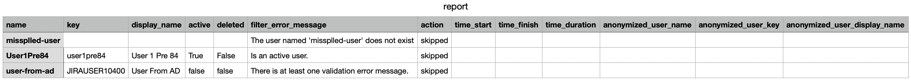

README
=

Other articles

- [Atlassian: Anonymizing users](https://confluence.atlassian.com/adminjiraserver/anonymizing-users-992677655.html)
- [Atlassian: Retrying anonymization](https://confluence.atlassian.com/adminjiraserver/retrying-anonymization-992677663.html)
- [Me: How anonymizing works with the Jira-UI](doc/How_anonymization_works_with_the_Jira-UI.md)
- [Me: About user-names and user-keys](doc/About_user-names_and_user-keys.md)

User Manual
=

- [Quick-start](#quick-start)
- [Command Line Options](#command-line-options)
  * [Overview](#overview)
  * [Parameter without command](#parameter-without-command)
  * [Parameters for command "inactive-users"](#parameters-for-command--inactive-users-)
  * [Parameters for command "validate"](#parameters-for-command--validate-)
  * [Parameters for command "anonymize"](#parameters-for-command--anonymize-)
  * [Parameters for command "misc"](#parameters-for-command--misc-)
  * [The config-file](#the-config-file)
  * [Combination of parameters from the config-file and the command-line](#combination-of-parameters-from-the-config-file-and-the-command-line)
  * [Details about some options](#details-about-some-options)
    + [--info](#--info)
    + [--user-list-file and --encoding](#--user-list-file-and---encoding)
- [How the Anonymizer works](#how-the-anonymizer-works)
- [The reports](#the-reports)
  * [Overview](#overview-1)
  * [The status printed to the command line](#the-status-printed-to-the-command-line)
- [The commands in detail](#the-commands-in-detail)
  * [Command "inactive-users"](#command--inactive-users-)
  * [Command "validate"](#command--validate-)
    + [Example 1: Validation succeeded, no validation error](#example-1--validation-succeeded--no-validation-error)
    + [Example 2: Validation failed for several reasons](#example-2--validation-failed-for-several-reasons)
  * [Command "anonymize"](#command--anonymize-)
    + [About](#about)
    + [Example 1: Anonymization without errors](#example-1--anonymization-without-errors)
- [Example-Workflow](#example-workflow)
- [Known issues](#known-issues)
  * [Validation error-messages in unexpected language](#validation-error-messages-in-unexpected-language)
  * [Anonymization slow in case Jira is connected to a Oracle-DB](#anonymization-slow-in-case-jira-is-connected-to-a-oracle-db)
  * [Anonymized user-/key-/display-name is null](#anonymized-user--key--display-name-is-null)
  * [Tickets at Atlassian](#tickets-at-atlassian)

<small><i><a href='http://ecotrust-canada.github.io/markdown-toc/'>Table of contents generated with markdown-toc</a></i></small>

The Anonymizer is a Python3-script to help Jira-admins anonymizing Jira-users in bulk.

Atlassian introduced user anonymization in Jira 8.7. So the Anonymizer works in Jira
versions equal or greater than 8.7.

All information stated here is about Jira Server and Jira Data Center. Jira Cloud is not
considered.

# Quick-start

- Create the file `users.cfg` with the user-names to be anonymized, one user-name per
  line.
- Create a config-file-template: `anonymize_jira_users.py misc -g`. The
  file `my-bare-default-config.cfg` has been created.
- Rename the file, e.g. to `my-config.cfg`.
- In that file, set the attributes `jira_base_url`,
  `jira_auth`, `new_owner`.
- Call `anonymize_jira_users.py validate -c my-config.cfg` to see what would happen in
  case of anonymizing.
- Call `anonymize_jira_users.py anonymize -c my-config.cfg` to execute anonymization.
- Have a look at the report `anonymization_report.csv`. More details about the users are
  given in `anonymization_report_details.json`
- Make a re-index.

# Command Line Options

## Overview

You may call the Anonymizer with preceding `python`. Assure it is Python3.

Documentation is also available by the command line help `-h`.

The Anonymizer has the following commands:

- `inactive-users`: Retrieves a list of inactive, not-yet anonymized users. These users
  are candidates for anonymization.
- `validate`:            Validates user anonymization process.
- `anonymize`:           Anonymizes users.
- `misc`:                Bundle diverse functions. Currently `-g`
  to generate a template-config-file is the only function.

The above commands have different parameter-lists.

## Parameter without command

    --version             show program's version number and exit

## Parameters for command "inactive-users"

    -h, --help            show this help message and exit
    -l {DEBUG,INFO,WARNING,ERROR,CRITICAL}, --loglevel {DEBUG,INFO,WARNING,ERROR,CRITICAL}
                          Log-level. Defaults to INFO.
    -c CONFIG_FILE, --config-file CONFIG_FILE
                          Config-file to pre-set command-line-options. You can
                          generate a config-file-template with option 'misc -g'.
                          There are parameters in the config-file not present on
                          the command line. Empty parameters in the config-file
                          are ignored. Parameters given on the command line
                          overwrite parameters given in the config-file.
    -b JIRA_BASE_URL, --jira-base-url JIRA_BASE_URL
                          Jira base-URL.
    -a ADMIN_USER_AUTH, --jira-auth ADMIN_USER_AUTH
                          Admin user-authentication. Two auth-types are
                          supported: Basic, and Bearer (starting with Jira
                          8.14). The format for Basic is: 'Basic <user>:<pass>'.
                          The format for Bearer is: 'Bearer <token>'.
    -o REPORT_OUT_DIR, --report-out-dir REPORT_OUT_DIR
                          Output-directory to write the reports into. If it
                          doesn't exist, it'll be created. If you'd like the
                          date included, give something like `date
                          +%Y%m%d-%H%M%S-anonymize-instance1`. Defaults to '.'.
    --info                Print the effective config, and the character-encoding
                          Python suggests, then exit.
    -G EXCLUDE_GROUPS [EXCLUDE_GROUPS ...], --exclude-groups EXCLUDE_GROUPS [EXCLUDE_GROUPS ...]
                          Exclude members of these groups. Multiple groups must
                          be space-separated. If a group contains spaces, the
                          group must be enclosed in single or double quotes.

## Parameters for command "validate"

      -h, --help            show this help message and exit
      -l {DEBUG,INFO,WARNING,ERROR,CRITICAL}, --loglevel {DEBUG,INFO,WARNING,ERROR,CRITICAL}
                            Log-level. Defaults to INFO.
      -c CONFIG_FILE, --config-file CONFIG_FILE
                            Config-file to pre-set command-line-options. You can
                            generate a config-file-template with option 'misc -g'.
                            There are parameters in the config-file not present on
                            the command line. Empty parameters in the config-file
                            are ignored. Parameters given on the command line
                            overwrite parameters given in the config-file.
      -b JIRA_BASE_URL, --jira-base-url JIRA_BASE_URL
                            Jira base-URL.
      -a ADMIN_USER_AUTH, --jira-auth ADMIN_USER_AUTH
                            Admin user-authentication. Two auth-types are
                            supported: Basic, and Bearer (starting with Jira
                            8.14). The format for Basic is: 'Basic <user>:<pass>'.
                            The format for Bearer is: 'Bearer <token>'.
      -o REPORT_OUT_DIR, --report-out-dir REPORT_OUT_DIR
                            Output-directory to write the reports into. If it
                            doesn't exist, it'll be created. If you'd like the
                            date included, give something like `date
                            +%Y%m%d-%H%M%S-anonymize-instance1`. Defaults to '.'.
      -i USER_LIST_FILE, --user-list-file USER_LIST_FILE
                            File with user-names to anonymize or just to validate.
                            One user-name per line. Comments are allowed: They
                            must be prefixed by '#' and they must appear on their
                            own line. The character-encoding is platform dependent
                            Python suggests. If you have trouble with the
                            encoding, try out the parameter '--encoding'.
      --encoding ENCODING   Force a character-encoding for reading the user-list-
                            file. Empty means platform dependent Python suggests.
                            If you run on Win or the user-list-file was created on
                            Win, try out one of these encodings: utf-8, cp1252,
                            latin1.
      --expand-validation-with-affected-entities
                            Include 'affectedEntities' in the validation result.
                            This is only for documentation to enrich the detailed
                            report. It doesn't affect the anonymization. Doing so
                            could increase significantly execution time.
      --info                Print the effective config, and the character-encoding
                            Python suggests, then exit.

## Parameters for command "anonymize"

      -h, --help            show this help message and exit
      -l {DEBUG,INFO,WARNING,ERROR,CRITICAL}, --loglevel {DEBUG,INFO,WARNING,ERROR,CRITICAL}
                            Log-level. Defaults to INFO.
      -c CONFIG_FILE, --config-file CONFIG_FILE
                            Config-file to pre-set command-line-options. You can
                            generate a config-file-template with option 'misc -g'.
                            There are parameters in the config-file not present on
                            the command line. Empty parameters in the config-file
                            are ignored. Parameters given on the command line
                            overwrite parameters given in the config-file.
      -b JIRA_BASE_URL, --jira-base-url JIRA_BASE_URL
                            Jira base-URL.
      -a ADMIN_USER_AUTH, --jira-auth ADMIN_USER_AUTH
                            Admin user-authentication. Two auth-types are
                            supported: Basic, and Bearer (starting with Jira
                            8.14). The format for Basic is: 'Basic <user>:<pass>'.
                            The format for Bearer is: 'Bearer <token>'.
      -o REPORT_OUT_DIR, --report-out-dir REPORT_OUT_DIR
                            Output-directory to write the reports into. If it
                            doesn't exist, it'll be created. If you'd like the
                            date included, give something like `date
                            +%Y%m%d-%H%M%S-anonymize-instance1`. Defaults to '.'.
      -i USER_LIST_FILE, --user-list-file USER_LIST_FILE
                            File with user-names to anonymize or just to validate.
                            One user-name per line. Comments are allowed: They
                            must be prefixed by '#' and they must appear on their
                            own line. The character-encoding is platform dependent
                            Python suggests. If you have trouble with the
                            encoding, try out the parameter '--encoding'.
      --encoding ENCODING   Force a character-encoding for reading the user-list-
                            file. Empty means platform dependent Python suggests.
                            If you run on Win or the user-list-file was created on
                            Win, try out one of these encodings: utf-8, cp1252,
                            latin1.
      --expand-validation-with-affected-entities
                            Include 'affectedEntities' in the validation result.
                            This is only for documentation to enrich the detailed
                            report. It doesn't affect the anonymization. Doing so
                            could increase significantly execution time.
      --info                Print the effective config, and the character-encoding
                            Python suggests, then exit.
      -D, --dry-run         Finally do not anonymize. To get familiar with the
                            script and to test it.
      -n NEW_OWNER, --new-owner NEW_OWNER
                            Transfer roles of all anonymized users to the user
                            with this user-name.
      -x, --background-reindex
                            If at least one user was anonymized, trigger a
                            background re-index.

## Parameters for command "misc"

      -h, --help            show this help message and exit
      -l {DEBUG,INFO,WARNING,ERROR,CRITICAL}, --loglevel {DEBUG,INFO,WARNING,ERROR,CRITICAL}
                            Log-level. Defaults to INFO.
      -g [CONFIG_TEMPLATE_FILE], --generate-config-template [CONFIG_TEMPLATE_FILE]
                            Generate a configuration-template. Defaults to my-
                            bare-default-config.cfg.

## The config-file

Most of the command-line-options can be set in a config-file. This file can be generated
by `anonymize_jira_users.py misc -g`.

A minimal config-file consists of:

    [DEFAULT]
    jira_base_url = http://localhost:2990/jira
    jira_auth = Basic admin:admin
    user_list_file = users.cfg
    new_owner = new-owner

Call:

`anonymize_jira_users.py anonymize -c my-config.cfg`

The full set of parameters are:

    ####
    #
    # Configuration for anonymize_jira_users.py
    #
    # General:
    #   - These values are true in any notation: ['yes', 'true', 'on'].
    #   - These values are false in any notation: ['no', 'false', 'off'].
    #
    ####
    
    [DEFAULT]
    
    #   Loglevel. Valid levels are DEBUG, INFO, WARNING, ERROR, CRITICAL.
    #   The given value is the default.
    #loglevel = INFO
    #   Jira base-URL.
    #   The given value is an example.
    #jira_base_url = http://localhost:2990/jira
    #   Admin user-authentication. Two auth-types are supported: Basic, and Bearer (staring with Jira 8.14).
    #       - The format for Basic is:   Basic <user>:<pass>
    #       - The format for Bearer is:  Bearer <token>
    #   The given values are examples.
    #jira_auth = Basic admin:admin
    #jira_auth = Bearer NDcyOTE1ODY4Nzc4Omj+FiGVuLh/vs4WjTS9/3lGaysM
    #   Exclude members of these groups at command 'inactive-users'.
    #   Each group must appear on its own line (except the first one), and must be indented.
    #   The given values are examples.
    #exclude_groups = group1
    #  group2
    #  group with spaces
    #   File with user-names to be anonymized or just validated. One user-name per line. 
    #   Comments are allowed: They must be prefixed by '#' and they must appear on their own line.
    #   The character-encoding is platform dependent Python suggests.
    #   If you have trouble with the encoding, try out the parameter '--encoding'.
    #   The given value is an example.
    #user_list_file = users.cfg
    #   Force a character-encoding for reading the user_list_file. Empty means platform dependent Python suggests.
    #   If you run on Win or the user_list_file was created on Win, try out one of these encodings:
    #     utf-8, cp1252, latin1 
    #   The given value is an example.
    #encoding = utf-8
    #   Output-directory to write the reports into.
    #report_out_dir = .
    #   Include 'affectedEntities' in the validation result. This is only for documentation 
    #   to enrich the detailed report. It doesn't affect the anonymization.
    #   Doing so could increase significantly execution time.
    #   The given value is the default.
    #is_expand_validation_with_affected_entities = False
    #   Finally do not anonymize. To get familiar with the script and to test it.
    #   The given value is the default.
    #is_dry_run = False
    #   Transfer roles to the user with this user-name.
    #   The given value is an example.
    #new_owner = new-owner
    #   Initial delay in seconds the Anonymizer waits after the anonymization is
    #   triggered and the first call to get the anonymization-progress.
    #   The default of Jira is 10 seconds, and this is also the default of the Anonymizer.
    #initial_delay = 10
    #   The delay in seconds between calls to get the anonymization-progress.
    #   The default of Jira is 3 seconds, and this is also the default of the Anonymizer.
    #regular_delay = 3
    #   Time in seconds the anonymization shall wait to be finished.
    #   0 (or any negative value) means: Wait as long as it takes.
    #   The given value is the default.
    #timeout = 0
    #   If at least one user was anonymized, trigger a background re-index.
    #   The given value is the default.
    #is_trigger_background_reindex = False

## Combination of parameters from the config-file and the command-line

The Anonymizer has up to three places where configurations could exist:

1. The internal default-configuration.
2. Your settings from the config-file (which overwrites the internal
   default-configuration).
3. Your parameters given on the command line (which overwrites the settings from the
   config-file).

The anonymizer builds an effective configuration from the above configurations.

You can combine parameters from a config-file and the command-line. E.g. if you don't want
your auth-settings stay in a file because you like to check-in this, you can set them at
the command-line using environment-variables:

    export MY_USERNAME=admin
    export MY_PASSWORD=admin
    anonymize_jira_users.py validate -c my-config.cfg -a "Basic $MY_USERNAME:$MY_PASSWORD"

## Details about some options

### --info

Print the effective config, and the character-encoding Python suggests, then exit.

You can combine this parameter with parameters of `validate` and `anonymize`
If `--info` is given in these cases, these commands won't be executed.

### --user-list-file and --encoding

Dependent on how and where the user-list-file was created, you could come into trouble
with the encoding. You can possibly fix this with an explicit character-encoding. To get
an idea what Python suggests on your current platform, execute

`anonymize_jira_users.py validate --info`.

This will print the current configuration as JSON. There'll be the two vars:

    {
        ...
        "locale_getpreferredencoding": "UTF-8",
        "sys_getfilesystemencoding": "utf-8"
        ...
    }

On Windows, this could be

    {
        ...
        "locale_getpreferredencoding": "cp1252",
        "sys_getfilesystemencoding": "utf-8"
        ...
    }

If the file was created on Windows and you execute the Anonymizer on a different platform,
try e.g.:

`anonymize_jira_users.py validate --encoding cp1252 <your options goes here...>`

or play around with other encodings.

# How the Anonymizer works

The Anonymizer executes the following steps for the `validation` and the `anonymization`
command:

- Parse and check the parameters.
- Read the user-names from the user-list-file.
- For each user: Get user-data from
  the [Jira user REST-API](https://docs.atlassian.com/software/jira/docs/api/REST/8.14.1/#api/2/user-getUser)
  . This is a check if a user exists.
- For each user: Get anonymization validation data from the
  [Jira Anonymization REST API](https://docs.atlassian.com/software/jira/docs/api/REST/8.14.1/#api/2/user/anonymization)
  .
- For each user: Filter against criteria if the user shall be anonymized or not, and keep
  an 'anonymization approval'.

If the command `anonymize` is called, additionally to the steps above:

- For each user: Run anonymization for each user with an 'anonymization approval'
  with [Jira Anonymization REST API](https://docs.atlassian.com/software/jira/docs/api/REST/8.14.1/#api/2/user/anonymization)
  . Transfer ownership to the user given in `--new-owner`.

Finally, in both cases `validation` and `anonymization`:

- Create the anonymization-reports.
- Print out a status.

The validation is a subset of the anonymization. So validation is done any time the
anonymization is done. With validation only you can get an impression what would happen in
case of anonymization.

The filter-criteria to not anonymize (= to skip), and their filter-error-messages are:

1. The user isn't existent: `The user named 'user-1' does not exist`.
2. The user is active: `Is an active user.`
3. The anonymization validation REST API didn't return 200
   OK: `HTTP status-code of the REST validation API is not 200.` Please have a look at
   the `anonymization_report_details.json` and
   [Jira Anonymization REST API](https://docs.atlassian.com/software/jira/docs/api/REST/8.14.1/#api/2/user/anonymization)
   .
4. The anonymization validation REST API returned 200 OK with validation-error-message(s):
   `There is at least one validation error message.`
   Please have a look at the `anonymization_report_details.json`.

About 1) "The user isn't existent":

This is the case if
the [REST API](https://docs.atlassian.com/software/jira/docs/api/REST/8.14.1/#api/2/user-getUser)
can't find the user. Users can't be found if they have never existed. In case of deleted
users this is as follows: The REST API is capable to find deleted users starting with Jira
8.10. If a user was deleted (regardless in what Jira version), Jira 8.10 and later will
find it.

About 2) "The user is active":

Active users can also be anonymized by
[Jira Anonymization REST API](https://docs.atlassian.com/software/jira/docs/api/REST/8.14.1/#api/2/user/anonymization)
. But the Anonymizer doesn't do this either.

About 4) Validation-error-messages:

In case of validation-errors, _Jira_ prevents anonymization (this is not an implementation
of the Anonymizer).

Some figures about durations:

The durations of anonymization depend on the amount of issues, user-custom-fields, and I
think also on the DB-type. E.g. (in Jira 8.13.1):

- MySQL, license 250 users, 25.000 issues: 6 seconds/user
- Oracle, license 2.000 users, 200.000 issues: 12 minutes/user

# The reports

## Overview

The Anonymizer prints out a status to the command line, and creates these files:

- anonymizing_report_details.json: Some kind of 'internal log' the Anonymizer writes
  during its work.
- anonymizing_report.json: Information about the anonymized or just validated users. It is
  generated from anonymizing_report_details.json.
- anonymizing_report.csv: Content is as anonymizing_report.json, but in comma-separated
  format. The content is generated from and is equal to anonymizing_report.json.

The reports contain more information in case of command `anonymize` than in case of
just `validate`.

The report-files are discussed later in the examples for command `validate`
and `anonymize`.

## The status printed to the command line

It consists of

- the number of users found in the user-list-file,
- the number of users not considered for anonymization (skipped),
- the number of anonymized users, and
- if a background re-index was triggered.

A user is not considered for anonymization (= skipped) if it matches a filter-criteria to
not anonymize as documented previously.

The report printed after `validate` looks like:

    Anonymizing Result:
      Users in user-list-file:  11
      Skipped users:            4
      Anonymized users:         0
      Background re-index triggered:  False

The number of anonymized users are always 0, because `validate` only checks if the users
_could_ be anonymized. Be we can see here that 11 - 4 = 7 users would be anonymized.

The report printed after `anonymize` looks like:

    Anonymizing Result:
      Users in user-list-file:  11
      Skipped users:            4
      Anonymized users:         5
      Background re-index triggered:  True

The sum of skipped- and anonymized users is the number of users in the user-list-file
(if no script-error occurred).

# The commands in detail

## Command "inactive-users"

If you like to anonymize users in bulk, you need a list of these users. Without the
Anonymizer, you retrieved this list somehow.

You can proceed doing so, but the command `inactive-users` could ease this. It retrieves a
list of inactive, not-yet anonymized users. You can give groups with user to exclude by
parameter `--exclude-groups`.

Call:

`anonymize_jira_users.py inactive-users -c my-config.cfg --exclude-groups technical_users do_not_anonymize`

This creates the file inactive-users.cfg in the report-out-dir. The content is e.g.:

    # File generated at 2021-01-14T21:36:05
    # Users: 4
    # User attributes: User-name; user-key; display-name; email-address
    
    # User1Post84; JIRAUSER10200; User 1 Post 84; user1post84@example.com
    User1Post84
    
    # User1Pre84; user1pre84; User 1 Pre 84; user1pre84@example.com
    User1Pre84
    
    # User2Post84; JIRAUSER10201; User 2 Post 84; user2post84@example.com
    User2Post84
    
    # User2Pre84; user2pre84; User 2 Pre 84; user2pre84@example.com
    User2Pre84

These users are candidates for anonymization. You should assess them.

## Command "validate"

Let me introduce my use-case dummy-users: `User1Pre84` and `User1Post84`.

The first user `User1Pre84` is an inactive, local user, and was created in a Jira-version
before 8.4. As we'll see in the reports, the user-name and the user-key are equal, as Jira
have not decided between them in versions before 8.4. Both are `User1Pre84`, but the
user-key in lower case.

The second user `User1Post84` is also an inactive, local user, but was created in Jira 8.4
or later. Since 8.4, the user-keys are something like JIRAUSER12345. The user-key
of `User1Post84` is `JIRAUSER10200`.

The Anonymizer does not distinguish between users created before or since Jira 8.4. But
just for the case you are curious why some user-keys in the Anonymizer's reports are equal
to the user-names, and some not.

### Example 1: Validation succeeded, no validation error

We'll use the following config-file `my-config.cfg`.

    [DEFAULT]
    jira_base_url = http://localhost:2990/jira
    jira_auth = Basic admin:admin
    user_list_file = assessed-inactive-users.cfg

Further we use the user-list-file `users.cfg` with our two users:

    User1Pre84
    User1Post84

We call:

`anonymize_jira_users.py validate -c my-config.cfg`

The output is:

    2021-01-11 20:56:34,870:INFO:read_users_from_user_list_file(): users.cfg
    2021-01-11 20:56:34,871:INFO:read_users_from_user_list_file(): The user-names are (2): ['User1Pre84', 'User1Post84']
    2021-01-11 20:56:34,871:INFO:get_users_data(): for 2 users
    2021-01-11 20:56:34,916:INFO:get_validation_data(): 
    2021-01-11 20:56:34,962:INFO:filter_users(): by existence and validation-data
    2021-01-11 20:56:34,962:INFO:filter_users(): 2 users remain for anonymization: ['User1Pre84', 'User1Post84']
    
    Anonymizing Result:
      Users in user-list-file:  2
      Skipped users:            0
      Anonymized users:         0
      Background re-index triggered:  False

A file `anonymization_report.json` has been created and is as follows. The interesting
lines per user are:

- `validation_has_errors: false`
- `filter_is_anonymize_approval: true`
- `filter_error_message: ""`

This means, the filter has left over both users for anonymization. In other words:
Both users haven't matched to any criteria to not anonymize a user. So thumps up for both
users.

If the filter had found any criteria not to anonymize a user, it would have given
an `filter_error_message`.

    {
        "overview": {
            "number_of_users_in_user_list_file": 2,
            "number_of_skipped_users": 0,
            "number_of_anonymized_users": 0,
            "is_background_reindex_triggered": false
        },
        "users": [
            {
                "user_name": "User1Pre84",
                "user_key": "user1pre84",
                "user_display_name": "User 1 Pre 84",
                "active": false,
                "validation_has_errors": false,
                "filter_is_anonymize_approval": true,
                "filter_error_message": "",
                "time_start": null,
                "time_finish": null,
                "time_duration": null,
                "anonymized_user_name": "",
                "anonymized_user_key": "",
                "anonymized_user_display_name": "",
                "action": "skipped"
            },
            {
                "user_name": "User1Post84",
                "user_key": "JIRAUSER10200",
                "user_display_name": "User 1 Post 84",
                "active": false,
                "validation_has_errors": false,
                "filter_is_anonymize_approval": true,
                "filter_error_message": "",
                "time_start": null,
                "time_finish": null,
                "time_duration": null,
                "anonymized_user_name": "",
                "anonymized_user_key": "",
                "anonymized_user_display_name": "",
                "action": "skipped"
            }
        ]
    }

The `action` can be `skipped` or `anonymized`. The `action`s here are `skipped` because we
validated only. No anonymization has been done.

Beside the `anonymization_report.json` the `anonymization_report.csv` has been created and
looks like the following screenshot:

### Example 2: Validation failed for several reasons

The users:

- `User1Pre84` is active
- `missplled-user` is not existent
- `user-from-ad` is inactive, but still connected to a read-only directory

Again, the filter do not give the anonymization approval if:

- the user doesn't exist, or
- the user is an active user, or
- the validation-step returned an unexpected HTTP status code (other than 200), or
  returned any validation error.

We call again:

`anonymize_jira_users.py validate -c my-config.cfg`

The output is:

    2021-01-11 21:17:44,425:INFO:read_users_from_user_list_file(): users.cfg
    2021-01-11 21:17:44,425:INFO:read_users_from_user_list_file(): The user-names are (3): ['User1Pre84', 'missplled-user', 'user-from-ad']
    2021-01-11 21:17:44,425:INFO:get_users_data(): for 3 users
    2021-01-11 21:17:44,495:INFO:get_validation_data(): 
    2021-01-11 21:17:44,521:INFO:filter_users(): by existence and validation-data
    2021-01-11 21:17:44,521:WARNING:filter_users(): User1Pre84: Is an active user.
    2021-01-11 21:17:44,521:WARNING:filter_users(): missplled-user: The user named 'misspelled-user' does not exist
    2021-01-11 21:17:44,521:WARNING:filter_users(): user-from-ad: There is at least one validation error message.
    2021-01-11 21:17:44,521:INFO:filter_users(): 0 users remain for anonymization: []
    
    Anonymizing Result:
      Users in user-list-file:  3
      Skipped users:            3
      Anonymized users:         0
      Background re-index triggered:  False

Have a look at these attributes in the anonymization_report.json:

- `has_validation_errors:`
- `filter_is_anonymize_approval`
- `filter_error_message:`

The JSON-report is:

    {
        "overview": {
            "number_of_users_in_user_list_file": 3,
            "number_of_skipped_users": 3,
            "number_of_anonymized_users": 0,
            "is_background_reindex_triggered": false
        },
        "users": [
            {
                "user_name": "User1Pre84",
                "user_key": "user1pre84",
                "user_display_name": "User 1 Pre 84",
                "active": true,
                "validation_has_errors": false,
                "filter_is_anonymize_approval": false,
                "filter_error_message": "Is an active user.",
                "time_start": null,
                "time_finish": null,
                "time_duration": null,
                "anonymized_user_name": "",
                "anonymized_user_key": "",
                "anonymized_user_display_name": "",
                "action": "skipped"
            },
            {
                "user_name": "missplled-user",
                "user_key": null,
                "user_display_name": null,
                "active": null,
                "validation_has_errors": false,
                "filter_is_anonymize_approval": false,
                "filter_error_message": "The user named 'missplled-user' does not exist",
                "time_start": null,
                "time_finish": null,
                "time_duration": null,
                "anonymized_user_name": "",
                "anonymized_user_key": "",
                "anonymized_user_display_name": "",
                "action": "skipped"
            },
            {
                "user_name": "user-from-ad",
                "user_key": "JIRAUSER10400",
                "user_display_name": "User From AD",
                "active": false,
                "validation_has_errors": false,
                "filter_is_anonymize_approval": false,
                "filter_error_message": "There is at least one validation error message.",
                "time_start": null,
                "time_finish": null,
                "time_duration": null,
                "anonymized_user_name": "",
                "anonymized_user_key": "",
                "anonymized_user_display_name": "",
                "action": "skipped"
            }
        ]
    }

In any of the above cases the `filter_is_anonymize_approval` is set to `false`.

Let's discuss what the filter has been read from `anonymization_report_details.json`
for each user to assess the result of `filter_is_anonymize_approval`.

User1Pre84:

The step "Get user-data from the Jira user REST-API" queries the user's data from
`GET /rest/api/2/user?includeDeleted=true&username=User1Pre84`. It returns HTTP
status-code `200 OK`, and in the response there is the attribute `"active": true`. Because
the filter follows the rule to only pass inactive users, it sets the
`"filter_is_anonymize_approval": false`.

missplled-user:

The step "Get user-data from the Jira user REST-API" queries the user's data from
`GET /rest/api/2/user?includeDeleted=true&username=missplled-user`. It returns HTTP
status-code `404 Not Found`, and in the response there is the error-message
`"errorMessages": ["The user named 'missplled-user' does not exist"]`. Because the filter
follows the rule to only pass users it could find, it sets the
`"filter_is_anonymize_approval": false`.

user-from-ad:

The validation was queried from `GET /rest/api/2/user/anonymization?userKey=JIRAUSER10400`
, the HTTP-status-code is `400 Bad Request`, and the response is:

    {
        "errors": {
            "USER_NAME_CHANGE": {
                "errorMessages": [
                    "We can't rename users from external directories. Delete this user from the external directory and then sync it with Jira."
                ],
                "errors": {}
            },
            "USER_DISABLE": {
                "errorMessages": [
                    "We can't anonymize this user, because the directory that contains them is read-only."
                ],
                "errors": {}
            },
            "USER_EXTERNAL_ID_CHANGE": {
                "errorMessages": [
                    "We can't change the user ID for this user. Delete this user from the external directory and then sync it with Jira."
                ],
                "errors": {}
            }
        },
        "warnings": {},
        "expand": "affectedEntities",
        "userKey": "JIRAUSER10400",
        "userName": "user-from-ad",
        "displayName": "User From AD",
        "deleted": false,
        "email": "user-from-ad@example.com",
        "success": false,
        "operations": [
            "USER_NAME_CHANGE",
            "USER_KEY_CHANGE_PLUGIN_POINTS",
            "USER_KEY_CHANGE",
            "USER_DISABLE",
            "USER_TRANSFER_OWNERSHIP_PLUGIN_POINTS",
            "USER_NAME_CHANGE_PLUGIN_POINTS",
            "USER_ANONYMIZE_PLUGIN_POINTS",
            "USER_EXTERNAL_ID_CHANGE"
        ],
        "businessLogicValidationFailed": false
    }

This response is stored in the `anonymization_report_details.json`. So if the Anonymizer
reports anything about a validation-error, search in that report by user-name or user-key.

## Command "anonymize"

### About

Anonymizing could be a long-running task for each user. The Anonymizer prints a
progress-percentage each minute. You can watch the progress also in the Jira admin-UI at
https://your-jira-url/secure/admin/user/AnonymizeUser!default.jspa

### Example 1: Anonymization without errors

We use this config-file `my-config.cfg`.

    [DEFAULT]
    jira_base_url = http://localhost:2990/jira
    jira_auth = Basic admin:admin
    user_list_file = users.cfg
    new_owner = new-owner
    # Speed up things a little bit (defaults are 10/3):
    initial_delay = 2
    regular_delay = 2

We use this user-list-file `users.cfg`:

    User1Pre84
    User2Pre84
    User1Post84
    User2Post84

All users are existent, inactive, and not connected to a read-only directory.
Users `User1Pre84` and `User1Post84` are no reporter or assignee in any issue.
User `User2Pre84` is assignee of issue EP-1, and `User2Post84`
is assignee of EP-2.

We call:

`anonymize_jira_users.py anonymize -c my-config.cfg`

The output is:

    2021-01-11 22:40:36,074:INFO:read_users_from_user_list_file(): users.cfg
    2021-01-11 22:40:36,074:INFO:read_users_from_user_list_file(): The user-names are (4): ['User1Pre84', 'User2Pre84', 'User1Post84', 'User2Post84']
    2021-01-11 22:40:36,074:INFO:get_users_data(): for 4 users
    2021-01-11 22:40:36,174:INFO:get_validation_data(): 
    2021-01-11 22:40:36,332:INFO:filter_users(): by existence and validation-data
    2021-01-11 22:40:36,332:INFO:filter_users(): 4 users remain for anonymization: ['User1Pre84', 'User2Pre84', 'User1Post84', 'User2Post84']
    2021-01-11 22:40:36,332:INFO:is_any_anonymization_running(): ?
    2021-01-11 22:40:36,332:INFO:get_anonymization_progress(): Checking if any anonymization is running
    2021-01-11 22:40:36,375:INFO:is_any_anonymization_running(): No
    2021-01-11 22:40:36,375:INFO:anonymize_users(): Going to anonymize 4 users
    2021-01-11 22:40:36,375:INFO:anonymize_users(): #1 (name/key): User1Pre84/user1pre84
    2021-01-11 22:40:38,618:INFO:anonymize_users(): #2 (name/key): User2Pre84/user2pre84
    2021-01-11 22:40:40,749:INFO:anonymize_users(): #3 (name/key): User1Post84/JIRAUSER10201
    2021-01-11 22:40:42,875:INFO:anonymize_users(): #4 (name/key): User2Post84/JIRAUSER10202
    
    Anonymizing Result:
      Users in user-list-file:  4
      Skipped users:            0
      Anonymized users:         4
      Background re-index triggered:  False

The `anonymization_report.json` is:

    {
        "overview": {
            "number_of_users_in_user_list_file": 4,
            "number_of_skipped_users": 0,
            "number_of_anonymized_users": 4,
            "is_background_reindex_triggered": false
        },
        "users": [
            {
                "user_name": "User1Pre84",
                "user_key": "user1pre84",
                "user_display_name": "User 1 Pre 84",
                "active": false,
                "validation_has_errors": false,
                "filter_is_anonymize_approval": true,
                "filter_error_message": "",
                "time_start": "2021-01-11T22:40:36",
                "time_finish": "2021-01-11T22:40:37",
                "time_duration": "00:01",
                "anonymized_user_name": "jirauser10101",
                "anonymized_user_key": "JIRAUSER10101",
                "anonymized_user_display_name": "user-438f1",
                "action": "anonymized"
            },
            {
                "user_name": "User2Pre84",
                "user_key": "user2pre84",
                "user_display_name": "User 2 Pre 84",
                "active": false,
                "validation_has_errors": false,
                "filter_is_anonymize_approval": true,
                "filter_error_message": "",
                "time_start": "2021-01-11T22:40:38",
                "time_finish": "2021-01-11T22:40:38",
                "time_duration": "00:01",
                "anonymized_user_name": "jirauser10102",
                "anonymized_user_key": "JIRAUSER10102",
                "anonymized_user_display_name": "user-c9f3b",
                "action": "anonymized"
            },
            {
                "user_name": "User1Post84",
                "user_key": "JIRAUSER10201",
                "user_display_name": "User 1 Post 84",
                "active": false,
                "validation_has_errors": false,
                "filter_is_anonymize_approval": true,
                "filter_error_message": "",
                "time_start": "2021-01-11T22:40:40",
                "time_finish": "2021-01-11T22:40:40",
                "time_duration": "00:01",
                "anonymized_user_name": "jirauser10201",
                "anonymized_user_key": "JIRAUSER10201",
                "anonymized_user_display_name": "user-649d0",
                "action": "anonymized"
            },
            {
                "user_name": "User2Post84",
                "user_key": "JIRAUSER10202",
                "user_display_name": "User 2 Post 84",
                "active": false,
                "validation_has_errors": false,
                "filter_is_anonymize_approval": true,
                "filter_error_message": "",
                "time_start": "2021-01-11T22:40:42",
                "time_finish": "2021-01-11T22:40:42",
                "time_duration": "00:01",
                "anonymized_user_name": "jirauser10202",
                "anonymized_user_key": "JIRAUSER10202",
                "anonymized_user_display_name": "user-c4ccb",
                "action": "anonymized"
            }
        ]
    }

Beside the `anonymization_report.json` the `anonymization_report.csv` has been created and
looks like the following screenshot:

Let's discuss what the filter has been read from `anonymization_report_details.json`
for the users to assess the result of `filter_is_anonymize_approval` and what finally
happened to the users.

user1pre84, user1post84:

The step "Get user-data from the Jira user REST-API" queries the user's data from
`GET /rest/api/2/user?includeDeleted=true&username=User1Pre84`. It returns HTTP
status-code `200 OK`, and in the response there is the attribute `"active": false`. The
validations-API returned no error. Because the filter follows the rule to only pass
existent, inactive users with no validation errors, it sets
the `"filter_is_anonymize_approval": true`.

User2Pre84, User2Post84:

Similar the previous user, but they are assignees in one issue each. The fact this user is
an assignee is no validation error as this will not prevent the anonymization.

`User2Pre84` was assignee of issue EP-1, and `User2Post84` was assignees of EP-2. We can
reverse check what are the user-names/-keys/-display-names now after the anonymization:

The user-data in the following list are: User-name / user-key / display-name.

- EP-1:
    - Former assignee `User2Pre84 / User2Pre84 / User 2 Pre 84`
    - Current assignee `jirauser10102 / JIRAUSER10102 / user-c9f3b`
- EP-2
    - Former assignee `user2post84 / JIRAUSER10201 / User 2 Post 84`
    - Current assignee `jirauser10201 / JIRAUSER10201 / user-c4ccb`

From the atlassian-jira.log:

    2021-01-11 22:40:36,410+0100 JiraTaskExecutionThread-1 INFO admin 1360x34x1 1gsb991 0:0:0:0:0:0:0:1 /rest/api/2/user/anonymization [c.a.j.user.anonymize.DefaultAnonymizeUserService] User key is not anonymized (user1pre84), should anonymize to (JIRAUSER10101)
    2021-01-11 22:40:36,410+0100 JiraTaskExecutionThread-1 INFO admin 1360x34x1 1gsb991 0:0:0:0:0:0:0:1 /rest/api/2/user/anonymization [c.a.j.user.anonymize.DefaultAnonymizeUserService] Username is not anonymized (User1Pre84), should rename to (jirauser10101)
    ...
    2021-01-11 22:40:38,645+0100 JiraTaskExecutionThread-2 INFO admin 1360x38x1 1gsb991 0:0:0:0:0:0:0:1 /rest/api/2/user/anonymization [c.a.j.user.anonymize.DefaultAnonymizeUserService] User key is not anonymized (user2pre84), should anonymize to (JIRAUSER10102)
    2021-01-11 22:40:38,645+0100 JiraTaskExecutionThread-2 INFO admin 1360x38x1 1gsb991 0:0:0:0:0:0:0:1 /rest/api/2/user/anonymization [c.a.j.user.anonymize.DefaultAnonymizeUserService] Username is not anonymized (User2Pre84), should rename to (jirauser10102)
    ...
    2021-01-11 22:40:40,775+0100 JiraTaskExecutionThread-3 INFO admin 1360x42x1 1gsb991 0:0:0:0:0:0:0:1 /rest/api/2/user/anonymization [c.a.j.user.anonymize.DefaultAnonymizeUserService] User key is already anonymized (JIRAUSER10201), no need to change it
    2021-01-11 22:40:40,775+0100 JiraTaskExecutionThread-3 INFO admin 1360x42x1 1gsb991 0:0:0:0:0:0:0:1 /rest/api/2/user/anonymization [c.a.j.user.anonymize.DefaultAnonymizeUserService] Username is not anonymized (User1Post84), should rename to (jirauser10201)
    ...
    2021-01-11 22:40:42,902+0100 JiraTaskExecutionThread-4 INFO admin 1360x46x1 1gsb991 0:0:0:0:0:0:0:1 /rest/api/2/user/anonymization [c.a.j.user.anonymize.DefaultAnonymizeUserService] User key is already anonymized (JIRAUSER10202), no need to change it
    2021-01-11 22:40:42,902+0100 JiraTaskExecutionThread-4 INFO admin 1360x46x1 1gsb991 0:0:0:0:0:0:0:1 /rest/api/2/user/anonymization [c.a.j.user.anonymize.DefaultAnonymizeUserService] Username is not anonymized (User2Post84), should rename to (jirauser10202)   

Note about `User1Pre84` and `User2Pre84`:

The user-names as well as the user-keys were anonymized:

    User key is not anonymized (user1pre84), should anonymize to (JIRAUSER10101)
    Username is not anonymized (user1pre84), should rename to (jirauser10101)
    ...
    User key is not anonymized (user2pre84), should anonymize to (JIRAUSER10102)
    Username is not anonymized (User2Pre84), should rename to (jirauser10102)

Note about `User1Post84` and `User2Post84`:

Only the user-name were anonymized:

    User key is already anonymized (JIRAUSER10201), no need to change it
    Username is not anonymized (User1Post84), should rename to (jirauser10201)
    ...
    User key is already anonymized (JIRAUSER10202), no need to change it
    Username is not anonymized (User2Post84), should rename to (jirauser10202)

# Example-Workflow

This example comprises of

1. Get a list of users as candidates for anonymization.
2. Assess and filter this list; create a new user-list with the remaining users.
3. Validate the users in that new user-list.
4. Anonymize the users in that new user-list.
5. Make a re-index, or let the Anonymizer trigger a re-index in step 4).

We'll use a directory-structure as follows:

    anonymization-reports         # The root-dir for all anonymizations
      <date>-<time>-<instance>    # The dir for the current anonymization
        1_inactive-use            # Sub-dir for reports of command 'inactive-users'
        2_validate                # Sub-dir for reports of command 'validate'
        3_anonymize               # Sub-dir for reports of command 'anonymize'

The commands are:

    # Set a report-dir for all steps. Here for the dev-instance 'inst1-d'.
    export ANONYMIZATION_REPORTS_BASE_DIR="anonymization-reports/`date +%Y%m%d-%H%M%S-inst1-d`"

    # 1. Get a list of users to be anonymized. This command creates the file 
    #   'inactive-users.cfg' in the report-dir.
    python anonymize_jira_users.py inactive-users -c anon_configs/inst1-d.cfg \
         --exclude-groups technical_users do_not_anonymize\
        -o $ANONYMIZATION_REPORTS_BASE_DIR/1_inactive-users

    # 2. Assess and filter this list; create a new user-list 'assessed-inactive-users.cfg'.
    # ...

    # 3. Validate the users in that list. Have a look at anonymizing_report.csv afterwards.
    python anonymize_jira_users.py validate -c anon_configs/inst1-d.cfg \
        -o $ANONYMIZATION_REPORTS_BASE_DIR/2_validate \
        -i $ANONYMIZATION_REPORTS_BASE_DIR/1_inactive-users/assessed-inactive-users.cfg

    # 4. Anonymize the users in that list.
    python anonymize_jira_users.py anonymize -c anon_configs/inst1-d-config.cfg \
        -o $ANONYMIZATION_REPORTS_BASE_DIR/3_anonymize \
        -i $ANONYMIZATION_REPORTS_BASE_DIR/1_inactive-users/assessed-inactive-users.cfg
    
    # 5. Make a re-index. You could let the Anonymizer do this by setting the option '-x'.

# Known issues

## Validation error-messages in unexpected language

The returned error-messages in the JSON-responses
from [Jira Anonymization REST API](https://docs.atlassian.com/software/jira/docs/api/REST/8.14.1/#api/2/user/anonymization)
are expected in the language-setting of the executing admin. But they're sometimes in a
different language. Is this different language the one of the user to be anonymized, or
the Jira-system-default-language? Or other?

## Anonymization slow in case Jira is connected to a Oracle-DB

- [JRASERVER-71251 Improve User Anonymize Feature](https://jira.atlassian.com/browse/JRASERVER-71251)

## Anonymized user-/key-/display-name is null

The following issues occured in my local test-instance.

I my tests I saw occurences where the anonymized user-name, user-key, and display-name are
null. I saw two root-causes:

1. Despite the fact the audit log is present, the query of the Anonyizer got an empty
   result.
2. Accessing the audit log results in an exception. This status persist. If you open the
   audit log in the UI, you'll get an UI-error-message like "
   We couldn't load audit events. Try again later.", and an Exception is shown in the
   atlassian-jira.log. A Jira-restart didn't fix this. Seen in several Jira-versions. A
   similar issue is filed for
   Bitbucket: [BSERV-12516 Audit Log feature unable to load older logs and run into error](https://jira.atlassian.com/browse/BSERV-12516)

## Tickets at Atlassian

- [JSDSERVER-6886 Allow bulk-nonymizing users](https://jira.atlassian.com/browse/JSDSERVER-6886)
- [JSDSERVER-6881 During the anonymization steps, Jira should additional display the future anonymized user name](https://jira.atlassian.com/browse/JSDSERVER-6881)
- [JRASERVER-71251 Improve User Anonymize Feature](https://jira.atlassian.com/browse/JRASERVER-71251)
