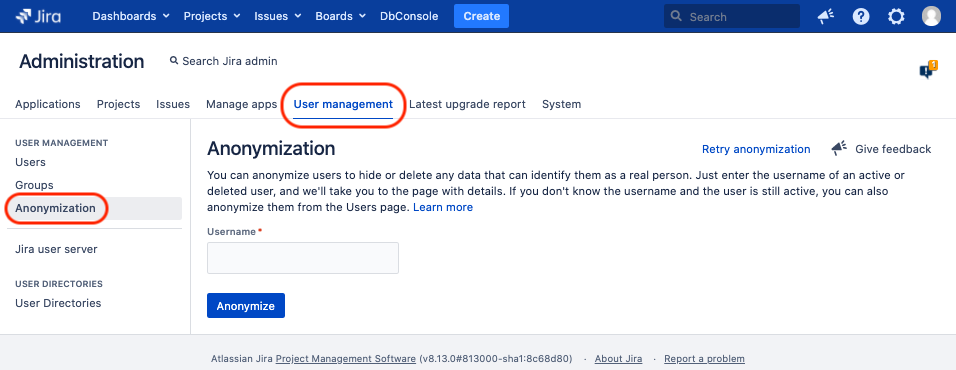
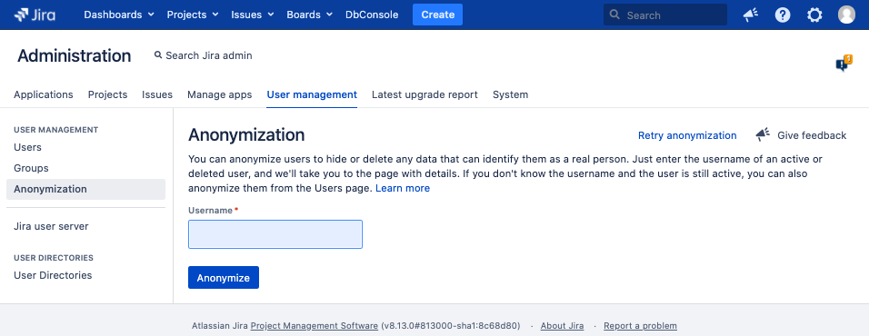
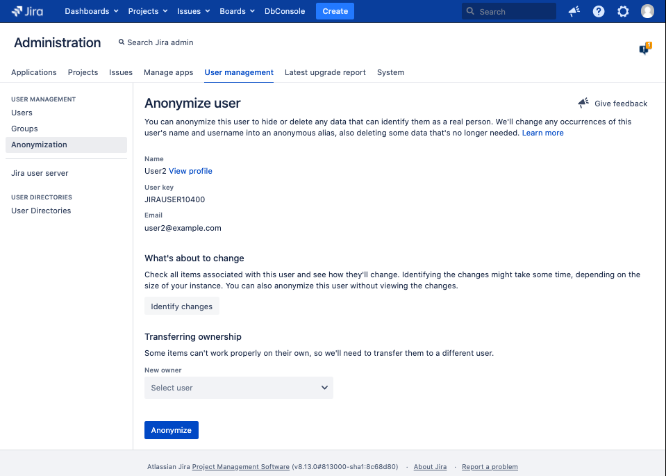
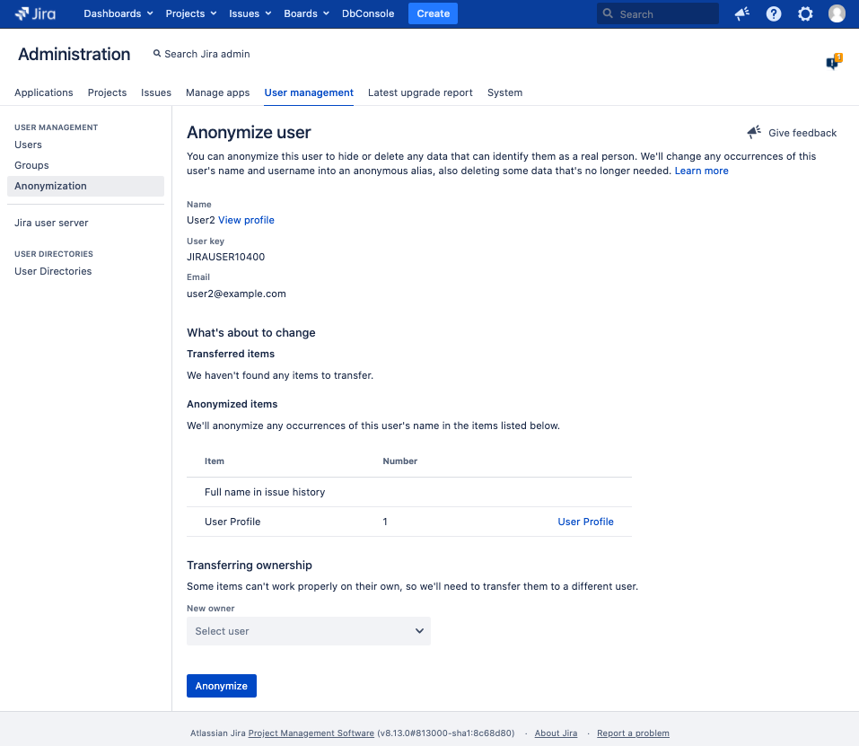
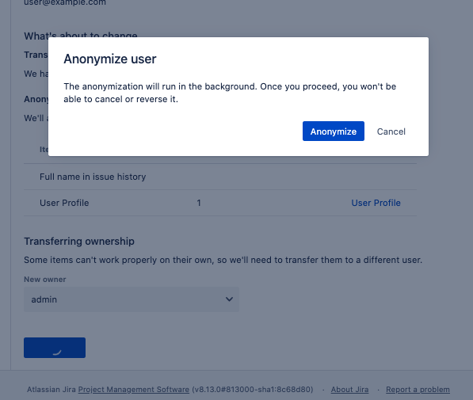
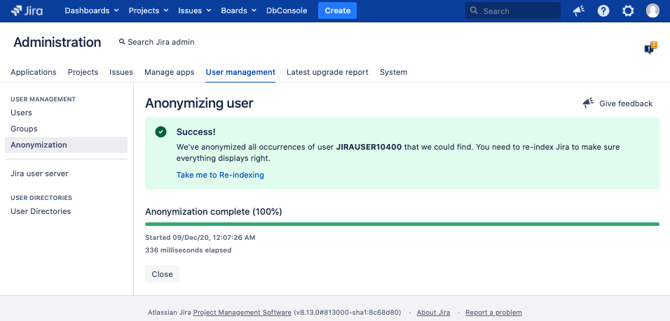
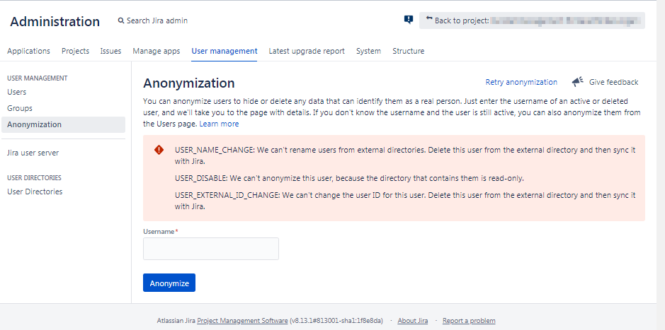

How anonymizing works with the Jira-UI
=

- [Introduction](#introduction)
- [Examples](#examples)
  * [Example 1](#example-1)
  * [Example 2: User is in external directory and can't be anonymized](#example-2--user-is-in-external-directory-and-can-t-be-anonymized)
    + [About the timing](#about-the-timing)

# Introduction

This document is intended for Jira-admins interested in the technical details
of user-anonymization.

The information given in this document were evaluated in Jira 8.13.

# Examples

## Example 1

We are a Jira admin and are going to anonymize the user with user-name `user2`.
We'll use the admin-UI (not the REST API).
`user2` hasn't any ownership and is no reporter, no assignee, no commenter, not in 
any user-field,.... `user2` is only in Jira's internal directory, not synchronized 
from an external directory. There is no anonymization running.

**Admin-action:**

In the UI:

We click the "Anonymization" menu item in admin-section "User management", or gg anon. 

**Browser/Jira response:**

In the UI:

The browser shows the "Anonymization" page with an input-field called "Username".

In the background:

The browser calls the "Get progress" API
`GET /rest/api/2/user/anonymization/progress`. Jira does this because if
there is an anonymizing task running, the admin is not allowed to schedule another one.
Instead, Jira shows the progress of the anonymization currently be processed. 

In case there was no anonymization executed before since the last Jira-restart, 
Jira returns `404 Not Found` ("Returned if there is no user anonymization task found.")

Response:

    {
      "errorMessages": [
        "A user anonymization task could not be found"
      ],
      "errors": {}
    }

Despite the fact both the HTTP status-code as well as the `errorMessages` tell us 
about something negative, this means: Feel free to start your anonymization!

In case there was an anonymization before, there exists a stale but completed 
anonymization task in Jira. In this example of `user1`. Jira returns `200 OK`.

Response:

	{
	  "errors": {},
	  "warnings": {},
	  "userKey": "JIRAUSER10301",
	  "userName": "user1",
	  "fullName": "User1",
	  "progressUrl": "/rest/api/2/user/anonymization/progress?taskId=10100",
	  "currentProgress": 100,
	  "currentSubTask": "Anonymizing user in: Webhooks",
	  "submittedTime": "2020-12-08T21:14:31.428+0100",
	  "startTime": "2020-12-08T21:14:31.441+0100",
	  "finishTime": "2020-12-08T21:14:32.141+0100",
	  "operations": [
	    "USER_NAME_CHANGE",
	    "USER_DISABLE",
	    "USER_NAME_CHANGE_PLUGIN_POINTS",
	    "USER_ANONYMIZE_PLUGIN_POINTS",
	    "USER_EXTERNAL_ID_CHANGE"
	  ],
	  "status": "COMPLETED",
	  "executingNode": "",
	  "isRerun": false,
	  "rerun": false
	}

**Admin-action:**

In the UI:

The admin gives the user-name `user2` in the input field "Username" and clicks
the button "Anonymize".

**Browser/Jira response:**

In the UI:

Jira shows an extended UI with: Some user-information, the section "What's about
to change" with the button "Identify Changes", and the section "Transferring 
ownership" with a "New owner" user-picker.

In the Background:

o The browser calls the "Get progress" API
`GET /rest/api/2/user/anonymization/progress`. Atlassian does this (I think) 
because another Jira admin could have scheduled an anonymization in the meantime
(and it seems Jira does allow only one single anonymization at time). 
But in this example, no other anonymization was scheduled, so Jira returns again 
`404 Not Found`.
Interestingly the browser does this twice by immediate subsequent calls (don't know why).

o The browser calls `GET /rest/api/2/user?includeDeleted=true&username=user2`.
The user-name (not the user-key) `user2` is given as an URL-parameter.
Jira returns `200 OK` with a JSON representing the Jira-user.

o The browser calls the "Validate user anonymization" API 
`GET /rest/api/2/user/anonymization?userKey=JIRAUSER10400`.
The user-key (not the user-name) is given as an URL-parameter.
In this example there is nothing what could block the anonymization, so Jira 
returns `200 OK`. The response don't show any error or warning (as expected). 

Response:

    {
      "errors": {},
      "warnings": {},
      "expand": "affectedEntities",
      "userKey": "JIRAUSER10400",
      "userName": "user2",
      "displayName": "User2",
      "deleted": false,
      "email": "user2@example.com",
      "success": true,
      "operations": [
        "USER_NAME_CHANGE",
        "USER_DISABLE",
        "USER_TRANSFER_OWNERSHIP_PLUGIN_POINTS",
        "USER_NAME_CHANGE_PLUGIN_POINTS",
        "USER_ANONYMIZE_PLUGIN_POINTS",
        "USER_EXTERNAL_ID_CHANGE"
      ],
      "businessLogicValidationFailed": false
    }

**Admin-action:**

In the UI:

Before anonymization, we click the button "Identify changes". This step is 
optional, as we could go ahead to section "Transferring ownership", but we're
curious what `user2` has ownership for.

**Browser/Jira response:**

In the UI:

Jira now shows the section "Anonymized items" with 
"We'll anonymize any occurrences of this user's name in the items listed below."
In this example, "user" doesn't have any ownership.

In the Background:

The client calls the Anonymization Validation API
`GET /rest/api/2/user/anonymization?userKey=JIRAUSER10400&expand=affectedEntities`.
Jira returns `200 OK`.

Response:

    {
      "errors": {},
      "warnings": {},
      "expand": "affectedEntities",
      "userKey": "JIRAUSER10400",
      "userName": "user2",
      "displayName": "User2",
      "deleted": false,
      "email": "user2@example.com",
      "success": true,
      "affectedEntities": {
        "ANONYMIZE": [
          {
            "type": "ANONYMIZE",
            "description": "Full name in issue history"
          },
          {
            "type": "ANONYMIZE",
            "description": "User Profile",
            "numberOfOccurrences": 1,
            "uriDisplayName": "User Profile",
            "uri": "http://localhost:2990/jira/secure/ViewProfile.jspa?name=user2"
          }
        ]
      },
      "operations": [
        "USER_NAME_CHANGE",
        "USER_DISABLE",
        "USER_NAME_CHANGE_PLUGIN_POINTS",
        "USER_ANONYMIZE_PLUGIN_POINTS",
        "USER_EXTERNAL_ID_CHANGE"
      ],
      "businessLogicValidationFailed": false
    }

**Admin-action:**

In the UI:

The admin usese the user "admin" for taking over ownerships in question (if any),
and clicks the button "Anonymize".

**Browser/Jira response:**

The browser shows the dialog "Anonymize user", with the button "Anonymize".

**Admin-action:**

The admin clicks the button "Anonymize".

**Browser/Jira response:**

o The browser calls the "Schedule user anonymization" API
`POST /rest/api/2/user/anonymization`. Jira returns `202 Accepted`. The response
contains the `progressUrl`. This URL is used in the next call to keep track the
progress.

Response:

	{
	  "errors": {},
	  "warnings": {},
	  "userKey": "JIRAUSER10400",
	  "userName": "user2",
	  "fullName": "User2",
	  "progressUrl": "/rest/api/2/user/anonymization/progress?taskId=10100",
	  "currentProgress": 0,
	  "submittedTime": "2020-12-09T00:07:26.428+0100",
	  "operations": [],
	  "status": "IN_PROGRESS",
	  "executingNode": "",
	  "isRerun": false,
	  "rerun": false
	}

o Immediately after that the browser calls the "Get progress" API
`GET /rest/api/2/user/anonymization/progress?taskId=10100`. Jira returns
`200 OK`. The `status` in the response is `IN_PROGRESS`.

Response:

	{
	  "errors": {},
	  "warnings": {},
	  "userKey": "JIRAUSER10400",
	  "userName": "user2",
	  "fullName": "User2",
	  "progressUrl": "/rest/api/2/user/anonymization/progress?taskId=10100",
	  "currentProgress": 0,
	  "currentSubTask": "Removing user from: Permission schemes",
	  "submittedTime": "2020-12-09T00:07:26.428+0100",
	  "startTime": "2020-12-09T00:07:26.441+0100",
	  "operations": [],
	  "status": "IN_PROGRESS",
	  "executingNode": "",
	  "isRerun": false,
	  "rerun": false
	}

o The browser waits 10s. 

o The browser continues calling the progress-API with an 3s-interval until the
`status` is `COMPLETED`, which is the case in the 2nd call as shown in the following. In addition, the
`operations` shows what Jira has taken into account at anonymizing.

Response:

	{
	  "errors": {},
	  "warnings": {},
	  "userKey": "JIRAUSER10400",
	  "userName": "user2",
	  "fullName": "User2",
	  "progressUrl": "/rest/api/2/user/anonymization/progress?taskId=10100",
	  "currentProgress": 100,
	  "currentSubTask": "Anonymizing user in: Webhooks",
	  "submittedTime": "2020-12-09T00:07:26.428+0100",
	  "startTime": "2020-12-09T00:07:26.441+0100",
	  "finishTime": "2020-12-09T00:07:27.141+0100",
	  "operations": [
	    "USER_NAME_CHANGE",
	    "USER_DISABLE",
	    "USER_NAME_CHANGE_PLUGIN_POINTS",
	    "USER_ANONYMIZE_PLUGIN_POINTS",
	    "USER_EXTERNAL_ID_CHANGE"
	  ],
	  "status": "COMPLETED",
	  "executingNode": "",
	  "isRerun": false,
	  "rerun": false
	}

o The browser shows the page "Anonymizing user" with a "Success! We've anonymized
all occurrences of user JIRAUSER10400 that we could find. You need to re-index
Jira to make sure everything displays right.", and a 100% green progress bar.

We're done with `user2`!

**Admin-action:**

Re-index

Following the above procedure, we could anonymize some more users.
Finally we are adviced to perform a re-index to update the lucene-index. 
Albeit Jira shows the anonymized data in the UI, the lucene-index don't know 
anything about the renamed users yet. This means, JQL-filters won't work as
expected. So we have to perform a re-index. A backgroud re-index is absolutely
fine. A blocking full re-index isn't needed.

## Example 2: User is in external directory and can't be anonymized
We are a Jira-admin and are going to anonymize the user with user-name `user3`.
We'll use the admin-UI (not the REST API).
`user3` is present in several user-fields. And `user3` is synchronized from an
read-only Active Directory and still connected to it.
There is no anonymization running.

**Admin-action:**

In the UI:

We click the "Anonymization" menu item in admin-section "User management", or gg anon. 

**Browser/Jira response:**

In the UI:

The browser shows the "Anonymization" page with an input-field called "Username".

In the background:

o The browser calls the "Get progress" API `GET /rest/api/2/user/anonymization/progress`.
We expect either the `404 Not Found` ("Returned if there is no user anonymization
task found.") or the `200 OK` with a stale anonymization-task as seen in the 
Simple Example. In fact the respose is `200 OK`, but the response contains some 
errors. This is nothing else than another stale anonymization-task from trying anonymizing `user9`. 
The difference is, that anonymization failed. The reasons are given in the error
messages. So don't panic if you handle the anonymization by REST API and you 
think you call the "Get progress" API the first time, and Jira tells you
something about errors. Simply think about two things: 1. Is the `progressUrl`
in a response of _my_ scheduled anonymization? 2. Is the `status` equal to `COMPLETED`? 

Response:

	{
	  "errors": {
	    "USER_NAME_CHANGE": {
	      "errorMessages": [
	        "We can't rename users from external directories. Delete this user from the external directory and then sync it with Jira."
	      ],
	      "errors": {}
	    },
	    "USER_DISABLE": {
	      "errorMessages": [
	        "We can't anonymize this user, because the directory that contains them is read-only."
	      ],
	      "errors": {}
	    },
	    "USER_EXTERNAL_ID_CHANGE": {
	      "errorMessages": [
	        "We can't change the user ID for this user. Delete this user from the external directory and then sync it with Jira."
	      ],
	      "errors": {}
	    }
	  },
	  "warnings": {},
	  "userKey": "JIRAUSER10309",
	  "userName": "user9",
	  "fullName": "User9",
	  "progressUrl": "/rest/api/2/user/anonymization/progress?taskId=30705",
	  "currentProgress": 100,
	  "submittedTime": "2020-12-08T22:19:46.375+0100",
	  "startTime": "2020-12-08T22:19:46.377+0100",
	  "finishTime": "2020-12-08T22:25:15.977+0100",
	  "operations": [
	    "USER_NAME_CHANGE",
	    "USER_KEY_CHANGE_PLUGIN_POINTS",
	    "USER_KEY_CHANGE",
	    "USER_DISABLE",
	    "USER_NAME_CHANGE_PLUGIN_POINTS",
	    "USER_ANONYMIZE_PLUGIN_POINTS",
	    "USER_EXTERNAL_ID_CHANGE"
	  ],
	  "status": "COMPLETED",
	  "executingNode": "",
	  "isRerun": false,
	  "rerun": false
	}

**Admin-action:**

In the UI:

The admin gives the user-name "user3" in the input field "Username" and clicks
the button "Anonymize".

**Browser/Jira response:**

In the UI:

Jira shows errors:

- USER_NAME_CHANGE: We can't rename users from external directories. Delete this user from the external directory and then sync it with Jira.
- USER_DISABLE: We can't anonymize this user, because the directory that contains them is read-only.
- USER_EXTERNAL_ID_CHANGE: We can't change the user ID for this user. Delete this user from the external directory and then sync it with Jira.

In the Background:

o The browser calls the "Get progress" API `GET /rest/api/2/user/anonymization/progress`.
Interestingly Jira do this twice by immediate subsequent calls (don't know why).
There were anonymizations done before, so there is a stale anonymization-task. Jira
returns `200 OK` with information about that task in the response.

o The browser calls `GET /rest/api/2/user?includeDeleted=true&username=user3`.
The user-name (not the user-key) `user3` is given as an URL-parameter.
Jira returns `200 OK` with a JSON representing the Jira-user.

TODO The URL-parameter `includeDeleted=true` is unclear to I'm sure deleted users
can't be found by user-name (only by user-key).

Response:

    {
      "self": "http://localhost:2990/jira/rest/api/2/user?username=user3",
      "key": "user3",
      "name": "JIRAUSER10401",
      "emailAddress": "user3@example.com",
      "avatarUrls": {
        "48x48": "http://localhost:2990/jira/secure/useravatar?ownerId=2005718&avatarId=28259",
        "24x24": "http://localhost:2990/jira/secure/useravatar?size=small&ownerId=2005718&avatarId=28259",
        "16x16": "http://localhost:2990/jira/secure/useravatar?size=xsmall&ownerId=2005718&avatarId=28259",
        "32x32": "http://localhost:2990/jira/secure/useravatar?size=medium&ownerId=2005718&avatarId=28259"
      },
      "displayName": "User3",
      "active": true,
      "deleted": false,
      "timeZone": "Europe/Berlin",
      "locale": "en_UK",
      "groups": {
        "size": 6,
        "items": []
      },
      "applicationRoles": {
        "size": 1,
        "items": []
      },
      "expand": "groups,applicationRoles"
    }

o The browser calls the "Validate user anonymization" API 
`GET /rest/api/2/user/anonymization?userKey=JIRAUSER10401`.
The user-key (not the user-name) is given as an URL-parameter.
In this example there are validation-errors.
Jira returns `400 Bad Request`. 

Response:

    {
      "errors": {
        "USER_NAME_CHANGE": {
          "errorMessages": [
            "We can't rename users from external directories. Delete this user from the external directory and then sync it with Jira."
          ],
          "errors": {}
        },
        "USER_DISABLE": {
          "errorMessages": [
            "We can't anonymize this user, because the directory that contains them is read-only."
          ],
          "errors": {}
        },
        "USER_EXTERNAL_ID_CHANGE": {
          "errorMessages": [
            "We can't change the user ID for this user. Delete this user from the external directory and then sync it with Jira."
          ],
          "errors": {}
        }
      },
      "warnings": {},
      "expand": "affectedEntities",
      "userKey": "user3",
      "userName": "JIRAUSER10401",
      "displayName": "User3",
      "deleted": false,
      "email": "user3@example.com",
      "success": false,
      "operations": [
        "USER_NAME_CHANGE",
        "USER_KEY_CHANGE_PLUGIN_POINTS",
        "USER_KEY_CHANGE",
        "USER_DISABLE",
        "USER_TRANSFER_OWNERSHIP_PLUGIN_POINTS",
        "USER_NAME_CHANGE_PLUGIN_POINTS",
        "USER_ANONYMIZE_PLUGIN_POINTS",
        "USER_EXTERNAL_ID_CHANGE"
      ],
      "businessLogicValidationFailed": false
    }

### About the timing

Normal case:

     |--------10s--------|--3s--|--3s--|--~...~--|--3s--|
    
     *----*--------------*------*------*--~...~--*------*
    (1)  (2)           (3,4)   (4)    (4)       (4)   (5,6)

1. The Admin starts anonymizing (REST `POST /rest/api/2/user/anonymization`).
2. The browser immediately calls `GET /rest/api/2/user/anonymization/progress`.
   In the response, `status` is `IN_PROGRESS`.
3. The browser has waited a delay of 10s. Atlassian calls this the Initial Delay.
   Then the browser calls `GET /rest/api/2/user/anonymization/progress`.
   In the response, `status` is still `IN_PROGRESS`.
   The UI updates the "x milliseconds elapsed" in the UI (as you can see in 
   the screenshot between the progress bar and the Close-button).
4. The UI starts requesting the progress `GET /rest/api/2/user/anonymization/progress`
   with an 3s-interval. Atlassian calls this the Regular Delay.
5. The anonymization is completed, `GET /rest/api/2/user/anonymization/progress`
   returned `"status":"COMPLETED"`.
6. The UI shows completeness.

Special case A: Jira finished anonymizing in less than the Initial Delay of 10s.
Seen in small Jira-instances.

     |--------10s--------|
    
     *----*--------------*
    (1)  (2)          (3=5,6)

Special case B: Jira finished anonymizing "immediately".
Seen in my local dev-instance.
In this case, the immediate call after scheduling an anonymization 
to `GET /rest/api/2/user/anonymization/progress` returns `"status":"COMPLETED"`.

     |--------10s--------|
    
     *------*
    (1)  (3=5,6)
