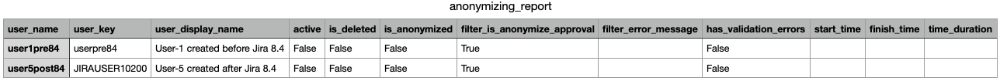
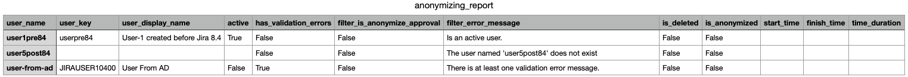
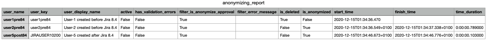

User Manual
=

# The Report Explained

TODO

# The Steps The Script Works With

TODO

- Parse and check the command line parameters
- Get the user-names from the infile
- Query user-data from Jira
- Get validation data for each user from the
  [Anonymization REST API](https://docs.atlassian.com/software/jira/docs/api/REST/8.13.2/#api/2/user/anonymization).
- Filter the users against a list of criteria if users shall be anonymized or not.
- Run user-anonymization for each user the filter has left over.
- Create the anonymization-report.

# Use Cases

## Create a config-file

You can let `anonymize_jira_users.py` create a config-file. The content is:

    {
      "base_url": "",
      "admin_user": "",
      "admin_pw": "",
      "infile": "usernames.txt",
      "loglevel": "INFO",
      "is_expand_validation_with_affected_entities": false,
      "is_dry_run": false,
      "is_try_delete_user": false,
      "new_owner_key": "",
      "initial_delay": 10,
      "regular_delay": 3,
      "timeout": 0,
      "features": null
    }

The config file is not to supplement the command line parameters each time. But you can mix 
parameters in the config-file and the command-line. If a parameter exists in both the 
config-file and the command-line, the one from the command-line wins.

A) Create config-file with default-name `my-config.json`:

    anonymize_jira_users.py -g

B) Create config-file with specific name `another-config.json`:

    anonymize_jira_users.py -g another-config.json

## Validate users

Let me introduce my use-case-dummy-users: `user1pre84` and `user5post84`.

The first user `user1pre84` is an inactive, local user, and was created in a 
Jira-version before 8.4. As we'll see in the reports, the user-name and the 
user-key are equal, as Jira have not decided between them in versions before 8.4. 
Both are `user1pre84`.

The second user `user5post84` is also an inactive, local user, and was created 
in Jira 8.4 or later. Since Jira 8.4, the user-keys are something like 
USERNAME12345. The user-key of `user5post84` is `JIRAUSER10200`.

`anonymize_jira_users.py` does not decide between user created before or since
Jira 8.4. But in case you are curious why some user-keys in your reports
are equal to the user-names, and some not.  

### Validation succeeded: No validation error

We'll use the following config-file. It differs from the above example only in
`base_url`, `admin_user`, `admin_pw`.

    {
        "base_url": "http:// localhost:2990/jira",
        "admin_user": "admin",
        "admin_pw": "admin",
        "infile": "usernames.txt",
        "loglevel": "INFO",
        "is_expand_validation_with_affected_entities": false,
        "is_dry_run": false,
        "is_try_delete_user": true,
        "new_owner_key": "",
        "initial_delay": 10,
        "regular_delay": 3,
        "timeout": 0,
        "features": null
    }

Further we use the infile `usernames.txt` with two users:

    user1pre84
    user5post84

We call:

`anonymize_jira_users.py validate -c my-config.json` 

The output is:

    2020-12-14 22:08:43,239:INFO:get_user_names_from_infile(): Reading user-names from infile usernames.txt
    2020-12-14 22:08:43,239:INFO:get_user_names_from_infile():   The user-names are: ['user1pre84', 'user5post84']
    2020-12-14 22:08:43,239:INFO:get_users_data_from_rest(): Reading user-data from GET /rest/api/2/user
    2020-12-14 22:08:43,290:INFO:get_validation_data_from_rest(): Reading validation-data (GET /rest/api/2/user/anonymization)
    2020-12-14 22:08:43,336:INFO:filter_users(): Filtering users by existence and against validation result
    2020-12-14 22:08:43,336:INFO:filter_users(): Remaining users to be anonymized: ['user1pre84', 'user5post84']
    2020-12-14 22:08:43,336:INFO:main(): Report overview: {"number_of_users_in_infile": 2, "number_of_skipped_users": 0, "number_of_deleted_users": 0, "number_of_anonymized_users": 0}

A file `anonymization_report.json` has been created and is as follows. 
The interesting lines are:
 - filter_is_anonymize_approval: true
 - filter_error_message: ""
 - has_validation_errors: false

This means, the filter has left over both users for anonymization. In other words: Both users
haven't matched to any criteria not to anonymize a user. So thumps up for both users. If 
the filter had found any criteria not to anonymize a user, it would have given an error-message.

    {
        "overview": {
            "number_of_users_in_infile": 2,
            "number_of_skipped_users": 0,
            "number_of_deleted_users": 0,
            "number_of_anonymized_users": 0
        },
        "users": [
            {
                "user_name": "user1pre84",
                "user_key": "userpre84",
                "user_display_name": "User-1 created before Jira 8.4",
                "active": false,
                "has_validation_errors": false,
                "filter_is_anonymize_approval": true,
                "filter_error_message": "",
                "is_deleted": false,
                "is_anonymized": false,
                "start_time": null,
                "finish_time": null,
                "time_duration": null
            },
            {
                "user_name": "user5post84",
                "user_key": "JIRAUSER10200",
                "user_display_name": "User-5 created after Jira 8.4",
                "active": false,
                "has_validation_errors": false,
                "filter_is_anonymize_approval": true,
                "filter_error_message": "",
                "is_deleted": false,
                "is_anonymized": false,
                "start_time": null,
                "finish_time": null,
                "time_duration": null
            }
        ]
    }

Furthermore the `anonymization_report.csv` has been created and looks like in the following
screenshot:

### Validation failed

The config-file is as in the previous use case. The infile is similar, but the user 
`user-from-ad` has been added. It is an inactive user.
This user is synchronized from a read-only directory, an Active Directory for example.

The users are different configured in Jira:
- user1pre84 is active
- user5post84 has been deleted

Again, the filter removes a user from the list in infile if:
- the user doesn't exist, 
- the user is an active user,
- the validation-step returned an unexpected HTTP status code (other than 200),
  or returned any validation error.
  
In any of the above cases the `filter_is_anonymize_approval` is set to `false`.

We call:

`anonymize_jira_users.py validate -c my-config.json` 

The output is:

    2020-12-14 23:00:34,858:INFO:get_user_names_from_infile(): Reading user-names from infile usernames.txt
    2020-12-14 23:00:34,858:INFO:get_user_names_from_infile():   The user-names are: ['user1pre84', 'user5post84', 'user-from-ad']
    2020-12-14 23:00:34,858:INFO:get_users_data_from_rest(): Reading user-data from GET /rest/api/2/user
    2020-12-14 23:00:34,928:INFO:get_validation_data_from_rest(): Reading validation-data (GET /rest/api/2/user/anonymization)
    2020-12-14 23:00:34,972:INFO:filter_users(): Filtering users by existence and against validation result
    2020-12-14 23:00:34,972:WARNING:filter_users(): user1pre84: Is an active user. Only inactive users will be taken into account.
    2020-12-14 23:00:34,972:WARNING:filter_users(): user5post84: The user named 'user5post84' does not exist
    2020-12-14 23:00:34,972:WARNING:filter_users(): user-from-ad: There is at least one validation error message.
    2020-12-14 23:00:34,972:INFO:filter_users(): Remaining users to be anonymized: ['user-from-ad']
    2020-12-14 23:00:34,973:INFO:main(): Report overview: {"number_of_users_in_infile": 3, "number_of_skipped_users": 2, "number_of_deleted_users": 0, "number_of_anonymized_users": 0}

The report is:

    {
        "overview": {
            "number_of_users_in_infile": 3,
            "number_of_skipped_users": 2,
            "number_of_deleted_users": 0,
            "number_of_anonymized_users": 0
        },
        "users": [
            {
                "user_name": "user1pre84",
                "user_key": "userpre84",
                "user_display_name": "User-1 created before Jira 8.4",
                "active": true,
                "has_validation_errors": false,
                "filter_is_anonymize_approval": false,
                "filter_error_message": "Is an active user.",
                "is_deleted": false,
                "is_anonymized": false,
                "start_time": null,
                "finish_time": null,
                "time_duration": null
            },
            {
                "user_name": "user5post84",
                "user_key": null,
                "user_display_name": null,
                "active": null,
                "has_validation_errors": false,
                "filter_is_anonymize_approval": false,
                "filter_error_message": "The user named 'user5post84' does not exist",
                "is_deleted": false,
                "is_anonymized": false,
                "start_time": null,
                "finish_time": null,
                "time_duration": null
            },
            {
                "user_name": "user-from-ad",
                "user_key": "JIRAUSER10400",
                "user_display_name": "User From AD",
                "active": false,
                "has_validation_errors": true,
                "filter_is_anonymize_approval": false,
                "filter_error_message": "There is at least one validation error message.",
                "is_deleted": false,
                "is_anonymized": false,
                "start_time": null,
                "finish_time": null,
                "time_duration": null
            }
        ]
    }

Let's discuss what the filter has been read from `anonymization_report_details.json` for 
each user to assess the result of `filter_is_anonymize_approval`.

user1pre84:

The step "Query user-data from Jira" queries the user's data from 
`GET /rest/api/2/user?username=user1pre84`. It returns HTTP status-code `200 OK`, and in the 
repsonse there is the attribute `"active": true`. Because the filter follows the rule only to 
pass inactive users, it sets the `"filter_is_anonymize_approval": false`.

user5post84:

The step "Query user-data from Jira" queries the user's data from 
`GET /rest/api/2/user?username=user5post84`. It returns HTTP status-code `404 Not Found`,
and in the response there is the error-message 
`"errorMessages": ["The user named 'user5post84' does not exist"]`.
Because the filter follows the rule only to 
pass existent users, it sets the `"filter_is_anonymize_approval": false`.

user-from-ad:

The validation was queried by `GET /rest/api/2/user/anonymization?userKey=JIRAUSER10400`, 
the HTTP-status-code is `200 OK`, and the response is: 

    {
        "errors": {
            "USER_NAME_CHANGE": {
                "errorMessages": [
                    "We can't rename users from external directories. Delete this user from the external directory and then sync it with Jira."
                ],
                "errors": {}
            },
            "USER_DISABLE": {
                "errorMessages": [
                    "We can't anonymize this user, because the directory that contains them is read-only."
                ],
                "errors": {}
            },
            "USER_EXTERNAL_ID_CHANGE": {
                "errorMessages": [
                    "We can't change the user ID for this user. Delete this user from the external directory and then sync it with Jira."
                ],
                "errors": {}
            }
        },
        "warnings": {},
        "expand": "affectedEntities",
        "userKey": "JIRAUSER10400",
        "userName": "user-from-ad",
        "displayName": "User From AD",
        "deleted": false,
        "email": "user-from-ad@example.com",
        "success": false,
        "operations": [
            "USER_NAME_CHANGE",
            "USER_KEY_CHANGE_PLUGIN_POINTS",
            "USER_KEY_CHANGE",
            "USER_DISABLE",
            "USER_TRANSFER_OWNERSHIP_PLUGIN_POINTS",
            "USER_NAME_CHANGE_PLUGIN_POINTS",
            "USER_ANONYMIZE_PLUGIN_POINTS",
            "USER_EXTERNAL_ID_CHANGE"
        ],
        "businessLogicValidationFailed": false
    }

## Anonymize Users

### No errors

We'll use the following config-file. It differs from the generated default in:

- `"base_url": "http:// localhost:2990/jira"`
- `"admin_user": "admin"`
- `"admin_pw": "admin"`
- `"new_owner_key": "admin"`

The config is:

    {
        "base_url": "http:// localhost:2990/jira",
        "admin_user": "admin",
        "admin_pw": "admin",
        "infile": "usernames.txt",
        "loglevel": "INFO",
        "is_expand_validation_with_affected_entities": false,
        "is_dry_run": false,
        "is_try_delete_user": true,
        "new_owner_key": "admin",
        "initial_delay": 10,
        "regular_delay": 3,
        "timeout": 0,
        "features": null
    }

Further we use the infile `usernames.txt` with two users:

    user1pre84
    user5post84

Both users are existent and inactive. User `user1pre84` is no reporter in any issue, nor
is assigned to any user-field. User `user5post84` is assignee of 1 issue. 

We call:

`anonymize_jira_users.py anonymize -c my-config.json` 

The output is:

    2020-12-15 00:37:44,647:INFO:get_user_names_from_infile(): Reading user-names from infile usernames.txt
    2020-12-15 00:37:44,647:INFO:get_user_names_from_infile():   The user-names are: ['user1pre84', 'user5post84']
    2020-12-15 00:37:44,647:INFO:get_users_data_from_rest(): Reading user-data from GET /rest/api/2/user
    2020-12-15 00:37:44,726:INFO:get_validation_data_from_rest(): Reading validation-data (GET /rest/api/2/user/anonymization)
    2020-12-15 00:37:44,840:INFO:filter_users(): Filtering users by existence and against validation result
    2020-12-15 00:37:44,840:INFO:filter_users(): Remaining users to be anonymized: ['user1pre84', 'user5post84']
    2020-12-15 00:37:44,840:INFO:is_any_anonymization_running(): ?
    2020-12-15 00:37:44,840:INFO:get_anonymization_progress(): Checking if any anonymization is running
    2020-12-15 00:37:44,875:INFO:is_any_anonymization_running(): No
    2020-12-15 00:37:44,875:INFO:run_user_anonymizations(): Going to delete or anonymize 2 users (POST /rest/api/2/user/anonymization)
    2020-12-15 00:37:44,875:INFO:run_user_anonymizations(): User (name/key) user1pre84/userpre84...
    2020-12-15 00:37:45,023:INFO:run_user_anonymizations(): User (name/key) user5post84/JIRAUSER10200...
    2020-12-15 00:37:55,130:INFO:wait_until_anonymization_has_finished(): for user user5post84
    2020-12-15 00:37:55,173:INFO:main(): Report overview: {"number_of_users_in_infile": 2, "number_of_skipped_users": 0, "number_of_deleted_users": 1, "number_of_anonymized_users": 1}

The `anonymization_report.json` is:

    {
        "overview": {
            "number_of_users_in_infile": 2,
            "number_of_skipped_users": 0,
            "number_of_deleted_users": 1,
            "number_of_anonymized_users": 1
        },
        "users": [
            {
                "user_name": "user1pre84",
                "user_key": "userpre84",
                "user_display_name": "User-1 created before Jira 8.4",
                "active": false,
                "has_validation_errors": false,
                "filter_is_anonymize_approval": true,
                "filter_error_message": "",
                "is_deleted": true,
                "is_anonymized": false,
                "start_time": "2020-12-15T00:37:45.023",
                "finish_time": null,
                "time_duration": null
            },
            {
                "user_name": "user5post84",
                "user_key": "JIRAUSER10200",
                "user_display_name": "User-5 created after Jira 8.4",
                "active": false,
                "has_validation_errors": false,
                "filter_is_anonymize_approval": true,
                "filter_error_message": "",
                "is_deleted": false,
                "is_anonymized": true,
                "start_time": "2020-12-15T00:37:45.099+0100",
                "finish_time": "2020-12-15T00:37:45.618+0100",
                "time_duration": "0:00:00.519000"
            }
        ]
    }

Furthermore the `anonymization_report.csv` has been created and looks like in the following
screenshot:

As the result, the anonymizer has deleted `user1pre84` and anonymized `user5post84`.

Let's discuss what the filter has been read from `anonymization_report_details.json` for 
the users to assess the result of `filter_is_anonymize_approval` and what finally happened to 
the users.

user1pre84:

The step "Query user-data from Jira" queries the user's data from 
`GET /rest/api/2/user?username=user1pre84`. It returns HTTP status-code `200 OK`, and in the 
repsonse there is the attribute `"active": false`.
The validations returned to error.
Because the filter follows the rule only to pass existent, inactive users with no 
validation errors, it sets the `"filter_is_anonymize_approval": true`.

In the config the `"is_try_delete_user": true` is set. This lets the anonymizer _try_ to
delete the user alternatively to anonymize it. The thought behind deletion is:
Jira does only allow deleting a user, if it is in any user-field or is a comment-author.
Why shall we keep and anonymize a user which never had left any traces in Jira?
If the anonymizer fails deleting, it proceeds with anonymization.

user5post84:

Similar this user, but it is an assignee in 1 issue. The fact this user is an assignee 
is no validation error as this will not prevent the anonymization. But deletion failed,
so it was anonymized.

## Anonymize Users And Report The Anonymized User-Data

TODO

Needs the feature "do_report_anonymized_user_data".

# The "Features"-feature

## Feature "do_report_anonymized_user_data"

TODO
