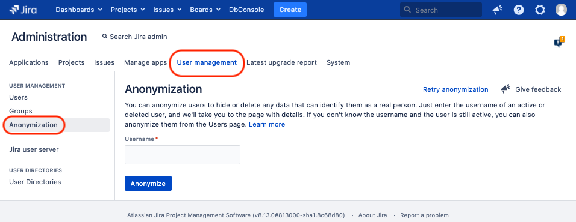
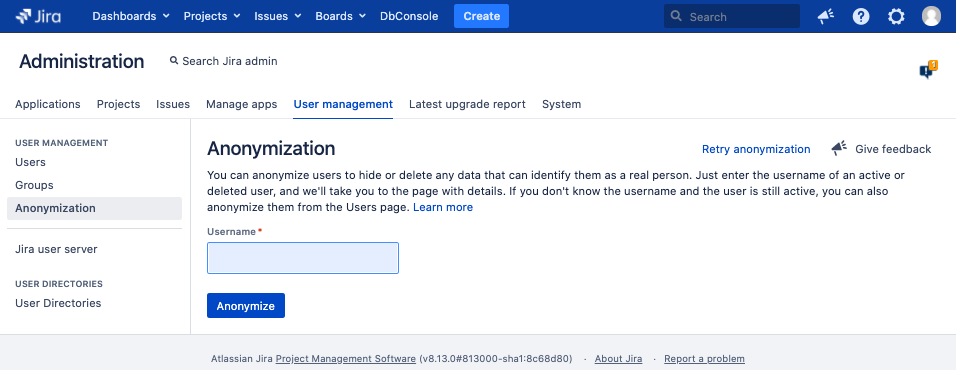
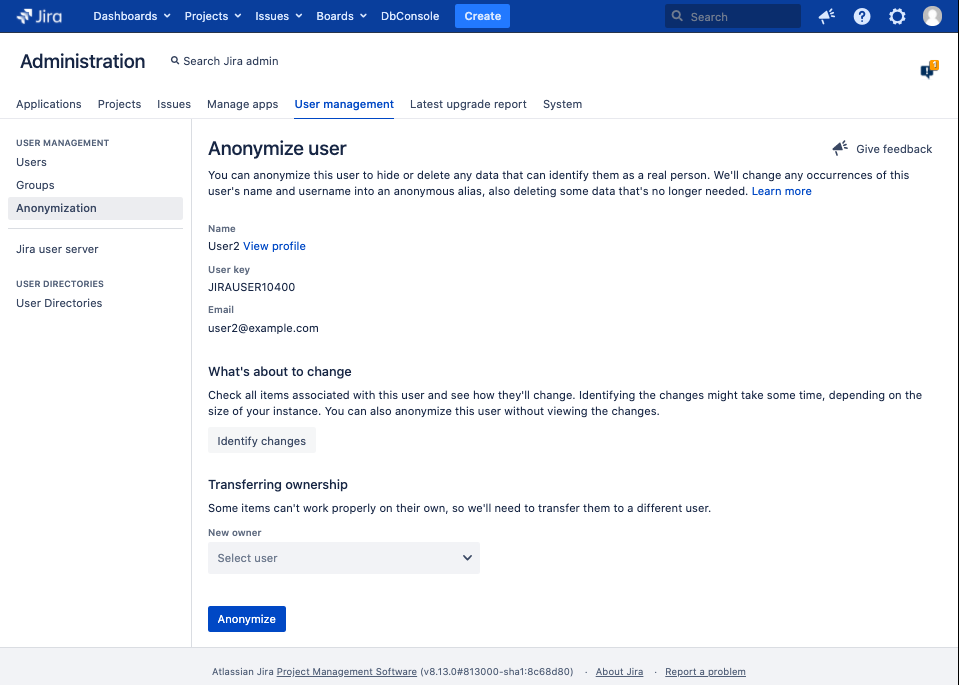
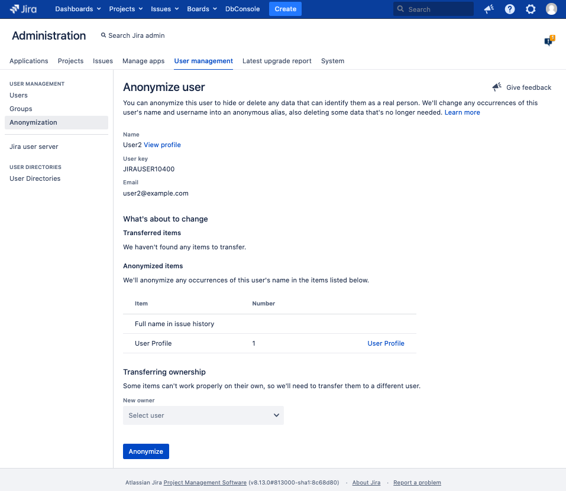
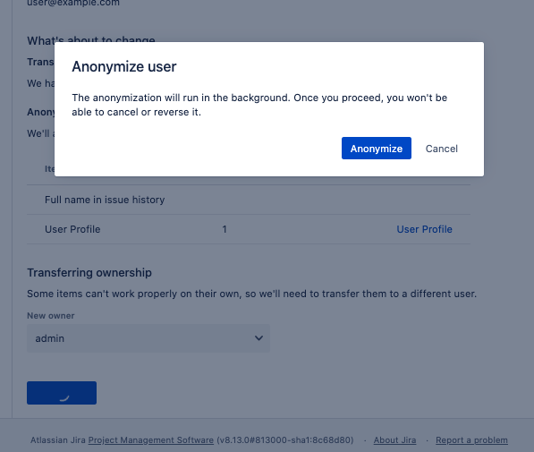
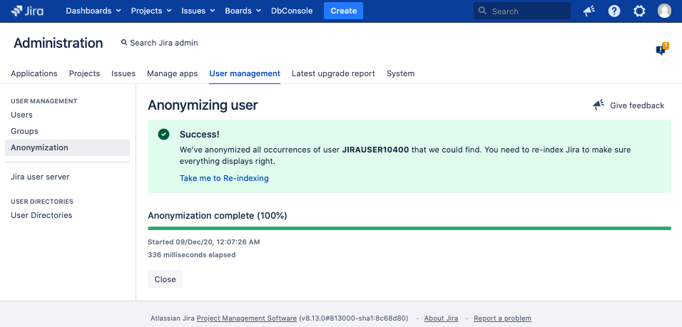
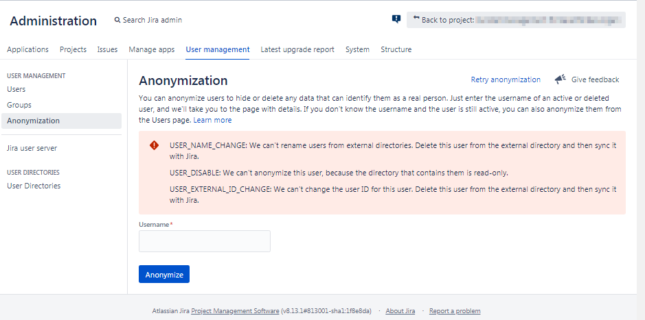

# Manual

This chapter is for users of the anonymizing-script. These are Jira 
administrators, as only those have the permission for anonymizing.

TODO

It is save to re-run an anonymization: At anonymization Jira changes the user-name.
The anonymization-script won't find an already anonymized user and will skip it.

# Anonymization

This document is for all interested in details about the anonymization API and
the implementation of the anonymizing-script.

All information stated here is about Jira Server and Jira Data Center. Jira Cloud
is not considered yet.

## Anonymizing with the admin-UI

Some of these results are reverse engineered in Jira 8.13.

### Example 1

We are a Jira system-admin and are going to anonymize the user with user-name "user2".
We'll use the admin-UI (not the REST API).
"user2" hasn't any ownership (is no reporter, no assignee, no commenter, not in 
any user-field,...). user2 is only in Jira's internal directory, not synchronized 
from an external directory. There is no anonymization running.

**Admin-action:**

In the UI:

We click the "Anonymization" menu item in admin-section "User management", or gg anon. 

**Browser/Jira response:**

In the UI:

The browser shows the "Anonymization" page with an input-field called "Username".

In the background:

The browser calls the "Get progress" API
`GET /rest/api/2/user/anonymization/progress`. Jira does this because if
there is an anonymizing task running, the admin is not allowed to schedule another one.
Instead, Jira shows the progress of the anonymization currently be processed. 

In case there was never any anonymization executed before, Jira returns
`404 Not Found` ("Returned if there is no user anonymization task found.")

Response:

    {
      "errorMessages": [
        "A user anonymization task could not be found"
      ],
      "errors": {}
    }

Despite the fact both the HTTP status-code as well as the `errorMessages` tell us 
about something negative, this means: Feel free to start your anonymization!

In case there was an anonymization before, there exists a stale but completed 
anonymization task in Jira. In this example of "user1". Jira returns `200 OK`.

Response:

	{
	  "errors": {},
	  "warnings": {},
	  "userKey": "JIRAUSER10301",
	  "userName": "user1",
	  "fullName": "User1",
	  "progressUrl": "/rest/api/2/user/anonymization/progress?taskId=10100",
	  "currentProgress": 100,
	  "currentSubTask": "Anonymizing user in: Webhooks",
	  "submittedTime": "2020-12-08T21:14:31.428+0100",
	  "startTime": "2020-12-08T21:14:31.441+0100",
	  "finishTime": "2020-12-08T21:14:32.141+0100",
	  "operations": [
	    "USER_NAME_CHANGE",
	    "USER_DISABLE",
	    "USER_NAME_CHANGE_PLUGIN_POINTS",
	    "USER_ANONYMIZE_PLUGIN_POINTS",
	    "USER_EXTERNAL_ID_CHANGE"
	  ],
	  "status": "COMPLETED",
	  "executingNode": "",
	  "isRerun": false,
	  "rerun": false
	}

**Admin-action:**

In the UI:

The admin gives the user-name "user2" in the input field "Username" and clicks
the button "Anonymize".

**Browser/Jira response:**

In the UI:

Jira shows an extended UI with: Some user-information, the section "What's about
to change" with the button "Identify Changes", and the section "Transferring 
ownership" with a "New owner" user-picker.

In the Background:

o The browser calls the "Get progress" API
`GET /rest/api/2/user/anonymization/progress`. Atlassian does this (I think) 
because another Jira admin could have scheduled an anonymization in the meantime
(and it seems Jira does allow only one single anonymization at time). 
But in this example, no other anonymization was scheduled, so Jira returns again 
`404 Not Found`.
Interestingly Jira do this twice by immediate subsequent calls (don't know why).

o The browser calls `GET /rest/api/2/user?includeDeleted=true&username=user2`.
The user-name (not the user-key) "user2" is given as an URL-parameter.
Jira returns `200 OK` with a JSON representing the Jira-user.

o The browser calls the "Validate user anonymization" API 
`GET /rest/api/2/user/anonymization?userKey=JIRAUSER10400`.
The user-key (not the user-name) is given as an URL-parameter.
In this example there is nothing what could block the anonymization, so Jira 
returns `200 OK`. The response don't show any error or warning (as expected). 

Response:

    {
      "errors": {},
      "warnings": {},
      "expand": "affectedEntities",
      "userKey": "JIRAUSER10400",
      "userName": "user2",
      "displayName": "User2",
      "deleted": false,
      "email": "user2@example.com",
      "success": true,
      "operations": [
        "USER_NAME_CHANGE",
        "USER_DISABLE",
        "USER_TRANSFER_OWNERSHIP_PLUGIN_POINTS",
        "USER_NAME_CHANGE_PLUGIN_POINTS",
        "USER_ANONYMIZE_PLUGIN_POINTS",
        "USER_EXTERNAL_ID_CHANGE"
      ],
      "businessLogicValidationFailed": false
    }

**Admin-action:**

In the UI:

Before anonymization, we click the button "Identify changes". This step is 
optional, as we could go ahead to section "Transferring ownership", but we're
curious what "user2" has ownership for.

**Browser/Jira response:**

In the UI:

Jira now shows the section "Anonymized items" with 
"We'll anonymize any occurrences of this user's name in the items listed below."
In this example, "user" doesn't have any ownership.

In the Background:

The client calls the Anonymization Validation API
`GET /rest/api/2/user/anonymization?userKey=JIRAUSER10400&expand=affectedEntities`.
Jira returns `200 OK`.

Response:

    {
      "errors": {},
      "warnings": {},
      "expand": "affectedEntities",
      "userKey": "JIRAUSER10400",
      "userName": "user2",
      "displayName": "User2",
      "deleted": false,
      "email": "user2@example.com",
      "success": true,
      "affectedEntities": {
        "ANONYMIZE": [
          {
            "type": "ANONYMIZE",
            "description": "Full name in issue history"
          },
          {
            "type": "ANONYMIZE",
            "description": "User Profile",
            "numberOfOccurrences": 1,
            "uriDisplayName": "User Profile",
            "uri": "http://localhost:2990/jira/secure/ViewProfile.jspa?name=user2"
          }
        ]
      },
      "operations": [
        "USER_NAME_CHANGE",
        "USER_DISABLE",
        "USER_NAME_CHANGE_PLUGIN_POINTS",
        "USER_ANONYMIZE_PLUGIN_POINTS",
        "USER_EXTERNAL_ID_CHANGE"
      ],
      "businessLogicValidationFailed": false
    }

**Admin-action:**

In the UI:

The admin use the user "admin" for taking over ownerships in question (if any),
and click the button "Anonymize".

**Browser/Jira response:**

The browser shows the dialog "Anonymize user", with the button "Anonymize".

**Admin-action:**

The admin clicks the button "Anonymize".

**Browser/Jira response:**

o The browser calls the "Schedule user anonymization" API
`POST /rest/api/2/user/anonymization`. Jira returns `202 Accepted`. The response
contains the `progressUrl`. This URL is used in the next call to keep track the
progress.

Response:

	{
	  "errors": {},
	  "warnings": {},
	  "userKey": "JIRAUSER10400",
	  "userName": "user2",
	  "fullName": "User2",
	  "progressUrl": "/rest/api/2/user/anonymization/progress?taskId=10100",
	  "currentProgress": 0,
	  "submittedTime": "2020-12-09T00:07:26.428+0100",
	  "operations": [],
	  "status": "IN_PROGRESS",
	  "executingNode": "",
	  "isRerun": false,
	  "rerun": false
	}

o Immediately after that the browser calls the "Get progress" API
`GET /rest/api/2/user/anonymization/progress?taskId=10100`. Jira returns
`200 OK`. The `status` in the response is `IN_PROGRESS`.

Response:

	{
	  "errors": {},
	  "warnings": {},
	  "userKey": "JIRAUSER10400",
	  "userName": "user2",
	  "fullName": "User2",
	  "progressUrl": "/rest/api/2/user/anonymization/progress?taskId=10100",
	  "currentProgress": 0,
	  "currentSubTask": "Removing user from: Permission schemes",
	  "submittedTime": "2020-12-09T00:07:26.428+0100",
	  "startTime": "2020-12-09T00:07:26.441+0100",
	  "operations": [],
	  "status": "IN_PROGRESS",
	  "executingNode": "",
	  "isRerun": false,
	  "rerun": false
	}

o The browser waits 10s. 

o The browser continues calling the progress-API with an 3s-interval until the
`status` is `COMPLETED`, which is the case in the 2nd call as shown in the following. In addition, the
`operations` shows what Jira has taken into account at anonymizing.

Response:

	{
	  "errors": {},
	  "warnings": {},
	  "userKey": "JIRAUSER10400",
	  "userName": "user2",
	  "fullName": "User2",
	  "progressUrl": "/rest/api/2/user/anonymization/progress?taskId=10100",
	  "currentProgress": 100,
	  "currentSubTask": "Anonymizing user in: Webhooks",
	  "submittedTime": "2020-12-09T00:07:26.428+0100",
	  "startTime": "2020-12-09T00:07:26.441+0100",
	  "finishTime": "2020-12-09T00:07:27.141+0100",
	  "operations": [
	    "USER_NAME_CHANGE",
	    "USER_DISABLE",
	    "USER_NAME_CHANGE_PLUGIN_POINTS",
	    "USER_ANONYMIZE_PLUGIN_POINTS",
	    "USER_EXTERNAL_ID_CHANGE"
	  ],
	  "status": "COMPLETED",
	  "executingNode": "",
	  "isRerun": false,
	  "rerun": false
	}

o The browser shows the page "Anonymizing user" with a "Success! We've anonymized
all occurrences of user JIRAUSER10300 that we could find. You need to re-index
Jira to make sure everything displays right.", and a 100% green progress bar.

We're done with "user2"!

**Admin-action:**

Re-index

Following the above procedure, we could anonymize some more users.
Finally we are adviced to perform a re-index to update the lucene-index. 
Albeit Jira shows the anonymized data in the UI, the lucene-index don't know 
anything about the renamed users yet. This means, JQL-filters won't work as
expected. So we have to perform a re-index. A backgroud re-index is absolutely
fine. A blocking full re-index isn't needed.

### Example 2: User is in external directory and can't be anonymized
We are a Jira system-admin and are going to anonymize the user with user-name "user3".
We'll use the admin-UI (not the REST API).
"user3" is present in several user-fields. And user3 is synchronized from an
Actiive Directory.
There is no anonymization running.

**Admin-action:**

In the UI:

We click the "Anonymization" menu item in admin-section "User management", or gg anon. 

**Browser/Jira response:**

In the UI:

The browser shows the "Anonymization" page with an input-field called "Username".

In the background:

o The browser calls the "Get progress" API `GET /rest/api/2/user/anonymization/progress`.
We expect either the `404 Not Found` ("Returned if there is no user anonymization
task found.") or the `200 OK` with a stale anonymization-task as seen in the 
Simple Example. In fact the respose is `200 OK`, but the response contains some 
errors. This is nothing else than another stale anonymization-task from trying anonymizing user9. 
The difference is, that anonymization failed. The reasons are given in the error
messages. So don't panic if you handle the anonymization by REST API and you 
think you call the "Get progress" API the first time, and Jira tells you
something about errors. Simply think about two things: 1. Is the `progressUrl`
in a response of _my_ scheduled anonymization? 2. Is the `status` equal to `COMPLETED`? 

Response:

	{
	  "errors": {
	    "USER_NAME_CHANGE": {
	      "errorMessages": [
	        "We can't rename users from external directories. Delete this user from the external directory and then sync it with Jira."
	      ],
	      "errors": {}
	    },
	    "USER_DISABLE": {
	      "errorMessages": [
	        "We can't anonymize this user, because the directory that contains them is read-only."
	      ],
	      "errors": {}
	    },
	    "USER_EXTERNAL_ID_CHANGE": {
	      "errorMessages": [
	        "We can't change the user ID for this user. Delete this user from the external directory and then sync it with Jira."
	      ],
	      "errors": {}
	    }
	  },
	  "warnings": {},
	  "userKey": "JIRAUSER10309",
	  "userName": "user9",
	  "fullName": "User9",
	  "progressUrl": "/rest/api/2/user/anonymization/progress?taskId=30705",
	  "currentProgress": 100,
	  "submittedTime": "2020-12-08T22:19:46.375+0100",
	  "startTime": "2020-12-08T22:19:46.377+0100",
	  "finishTime": "2020-12-08T22:25:15.977+0100",
	  "operations": [
	    "USER_NAME_CHANGE",
	    "USER_KEY_CHANGE_PLUGIN_POINTS",
	    "USER_KEY_CHANGE",
	    "USER_DISABLE",
	    "USER_NAME_CHANGE_PLUGIN_POINTS",
	    "USER_ANONYMIZE_PLUGIN_POINTS",
	    "USER_EXTERNAL_ID_CHANGE"
	  ],
	  "status": "COMPLETED",
	  "executingNode": "",
	  "isRerun": false,
	  "rerun": false
	}

**Admin-action:**

In the UI:

The admin gives the user-name "user3" in the input field "Username" and clicks
the button "Anonymize".

**Browser/Jira response:**

In the UI:

Jira shows errors:

- USER_NAME_CHANGE: We can't rename users from external directories. Delete this user from the external directory and then sync it with Jira.
- USER_DISABLE: We can't anonymize this user, because the directory that contains them is read-only.
- USER_EXTERNAL_ID_CHANGE: We can't change the user ID for this user. Delete this user from the external directory and then sync it with Jira.

In the Background:

o The browser calls the "Get progress" API `GET /rest/api/2/user/anonymization/progress`.
Interestingly Jira do this twice by immediate subsequent calls (don't know why).
There were anonymizations done before, so there is a stale anonymization-task. Jira
returns `200 OK` with information about that task in the response.

o The browser calls `GET /rest/api/2/user?includeDeleted=true&username=user3`.
The user-name (not the user-key) "user3" is given as an URL-parameter.
Jira returns `200 OK` with a JSON representing the Jira-user.

_TODO The URL-parameter `includeDeleted=true` is unclear to my as I assume deleted users
can't be found by user-name (only by user-key)._

Response:

    {
      "self": "http://localhost:2990/jira/rest/api/2/user?username=user3",
      "key": "user3",
      "name": "JIRAUSER10401",
      "emailAddress": "user3@example.com",
      "avatarUrls": {
        "48x48": "http://localhost:2990/jira/secure/useravatar?ownerId=2005718&avatarId=28259",
        "24x24": "http://localhost:2990/jira/secure/useravatar?size=small&ownerId=2005718&avatarId=28259",
        "16x16": "http://localhost:2990/jira/secure/useravatar?size=xsmall&ownerId=2005718&avatarId=28259",
        "32x32": "http://localhost:2990/jira/secure/useravatar?size=medium&ownerId=2005718&avatarId=28259"
      },
      "displayName": "User3",
      "active": true,
      "deleted": false,
      "timeZone": "Europe/Berlin",
      "locale": "en_UK",
      "groups": {
        "size": 6,
        "items": []
      },
      "applicationRoles": {
        "size": 1,
        "items": []
      },
      "expand": "groups,applicationRoles"
    }

o The browser calls the "Validate user anonymization" API 
`GET /rest/api/2/user/anonymization?userKey=JIRAUSERTODO`.
The user-key (not the user-name) is given as an URL-parameter.
In this example there are facts blocking the anonymization. Jira 
returns `400 Bad Request`. The response don't show any error or warning (as expected). 

Response:

    {
      "errors": {
        "USER_NAME_CHANGE": {
          "errorMessages": [
            "We can't rename users from external directories. Delete this user from the external directory and then sync it with Jira."
          ],
          "errors": {}
        },
        "USER_DISABLE": {
          "errorMessages": [
            "We can't anonymize this user, because the directory that contains them is read-only."
          ],
          "errors": {}
        },
        "USER_EXTERNAL_ID_CHANGE": {
          "errorMessages": [
            "We can't change the user ID for this user. Delete this user from the external directory and then sync it with Jira."
          ],
          "errors": {}
        }
      },
      "warnings": {},
      "expand": "affectedEntities",
      "userKey": "user3",
      "userName": "JIRAUSER10401",
      "displayName": "User3",
      "deleted": false,
      "email": "user3@example.com",
      "success": false,
      "operations": [
        "USER_NAME_CHANGE",
        "USER_KEY_CHANGE_PLUGIN_POINTS",
        "USER_KEY_CHANGE",
        "USER_DISABLE",
        "USER_TRANSFER_OWNERSHIP_PLUGIN_POINTS",
        "USER_NAME_CHANGE_PLUGIN_POINTS",
        "USER_ANONYMIZE_PLUGIN_POINTS",
        "USER_EXTERNAL_ID_CHANGE"
      ],
      "businessLogicValidationFailed": false
    }

### About the timing

Normal case:

     |--------10s--------|--3s--|--3s--|--~...~--|--3s--|
    
     *----*--------------*------*------*--~...~--*------*
    (1)  (2)           (3,4)   (4)    (4)       (4)   (5,6)

1. The Admin starts anonymizing (REST `POST /rest/api/2/user/anonymization`).
2. The browser immediately calls `GET /rest/api/2/user/anonymization/progress`.
   In the response, `status` is `IN_PROGRESS`.
3. The browser has waited a delay of 10s. Atlassian calls this the Initial Delay.
   Then the browser calls `GET /rest/api/2/user/anonymization/progress`.
   In the response, `status` is still `IN_PROGRESS`.
   The UI updates the "x milliseconds elapsed" in the UI (as you can see in 
   the screenshot between the progress bar and the Close-button).
4. The UI starts requesting the progress `GET /rest/api/2/user/anonymization/progress`
   with an 3s-interval. Atlassian calls this the Regular Delay.
5. The anonymization is completed, `GET /rest/api/2/user/anonymization/progress`
   returned `"status":"COMPLETED"`.
6. The UI shows completeness.

Special case A: Jira finished anonymizing in less than the Initial Delay of 10s.
Seen in small Jira-instances.

     |--------10s--------|
    
     *-------------------*
    (1)              (2,3/4,5)

Special case B: Jira finished anonymizing "immediately".
Seen in my local dev-instance.
In this case, the immediate call after scheduling an anonymization 
to `GET /rest/api/2/user/anonymization/progress` returns `"status":"COMPLETED"`.

     |--------10s--------|
    
     *------*
    (1)  (3/4,5)

## Anonymizing with the REST-API

Using the REST-API we're free to validate users first, or to schedule an anonymization
directly. But of cause it is good style to validate first.

`GET http://localhost:2990/jira/rest/api/2/user?username=user4`

Status: 200 OK

Response:

    {
        "self": "http://localhost:2990/jira/rest/api/2/user?username=user4",
        "key": "JIRAUSER10401",
        "name": "user4",
        "emailAddress": "user4@example.com",
        "avatarUrls": {
            "48x48": "https://www.gravatar.com/avatar/7e65550957227bd38fe2d7fbc6fd2f7b?d=mm&s=48",
            "24x24": "https://www.gravatar.com/avatar/7e65550957227bd38fe2d7fbc6fd2f7b?d=mm&s=24",
            "16x16": "https://www.gravatar.com/avatar/7e65550957227bd38fe2d7fbc6fd2f7b?d=mm&s=16",
            "32x32": "https://www.gravatar.com/avatar/7e65550957227bd38fe2d7fbc6fd2f7b?d=mm&s=32"
        },
        "displayName": "User4",
        "active": true,
        "deleted": false,
        "timeZone": "Europe/Berlin",
        "locale": "en_US",
        "groups": {
            "size": 2,
            "items": []
        },
        "applicationRoles": {
            "size": 2,
            "items": []
        },
        "expand": "groups,applicationRoles"
    }

TODO Schedule anonymization of a user with language setting DE 

### Unexpected behaviours

TODO The errors in JSON-responses were seen in a different language than set for the admin.
Unclear, if this is the language of the user to be / that were anonymized, or the Jira system-default.

## REST APIs

### Get user
[GET /rest/api/2/user](https://docs.atlassian.com/software/jira/docs/api/REST/8.13.2/#api/2/user-getUser)

This is only for reference. This API is not used in the anonymization-script.

### Anonymization API
There are an REST API and a Java API. In this document only the REST API is considered, as it 
is more flexible to use and much more easy to understand.

https://docs.atlassian.com/software/jira/docs/api/REST/8.13.0/#api/2/user/anonymization

#### Validate user anonymization
    GET /rest/api/2/user/anonymization
>Validates user anonymization process.

#### Schedule user anonymization
    POST /rest/api/2/user/anonymization

#### Get progress
    GET /rest/api/2/user/anonymization/progress

TODO

jira-project/jira-components/jira-plugins/jira-rest/jira-rest-plugin/src/main/java/com/atlassian/jira/rest/v2/user/anonymization/UserAnonymizationProgressBean.java

There is the HTTP status code 200 left. If that is returned, I have to look into the JSON responses "status"-
attribute. I haven't a mapping of HTTP status-code to progress "status"-attribute yet, by I have the list of
"status" values read from the Jira source code. These are:

- COMPLETED The anonymization process finished. Some errors or warnings might be present.
- INTERRUPTED There is no connection with the node that was executing the anonymization process. Usually, this
            means that the node crashed and the anonymization task needs to be cleaned up from the cluster.
- IN_PROGRESS The anonymization process is still being performed.
- VALIDATION_FAILED The anonymization process hasn't been started because the validation has failed for some 
            anonymization handlers.

#### Some use cases

##### Admin tries to anonymize themself

URL: http://localhost:2990/jira/rest/api/2/user/anonymization?userKey=admin

Status: 400 Bad Request

Response:

    {
        "errors": {
            "GENERAL": {
                "errorMessages": [
                    "You can't anonymize yourself."
                ],
                "errors": {}
            }
        },
        "warnings": {},
        "expand": "affectedEntities",
        "userKey": "admin",
        "deleted": false,
        "success": false,
        "operations": [],
        "businessLogicValidationFailed": false
    }

POST http://localhost:2990/jira/rest/api/2/user/anonymization

Status: 202 Accepted

Response:

    {
        "errors": {},
        "warnings": {},
        "userKey": "admin",
        "userName": "admin",
        "fullName": "admin",
        "progressUrl": "/rest/api/2/user/anonymization/progress?taskId=10104",
        "currentProgress": 0,
        "submittedTime": "2020-12-10T13:25:06.127+0100",
        "operations": [],
        "status": "IN_PROGRESS",
        "executingNode": "",
        "isRerun": false,
        "rerun": false
    }

GET http://localhost:2990/jira/rest/api/2/user/anonymization/progress

Status: 200

Response: 

    {
        "errors": {
            "GENERAL": {
                "errorMessages": [
                    "You can't anonymize yourself."
                ],
                "errors": {}
            }
        },
        "warnings": {},
        "userKey": "admin",
        "userName": "admin",
        "fullName": "admin",
        "progressUrl": "/rest/api/2/user/anonymization/progress?taskId=10104",
        "currentProgress": 100,
        "submittedTime": "2020-12-10T13:25:06.127+0100",
        "startTime": "2020-12-10T13:25:06.128+0100",
        "finishTime": "2020-12-10T13:25:06.131+0100",
        "operations": [],
        "status": "COMPLETED",
        "executingNode": "",
        "isRerun": false,
        "rerun": false
    }

---

# More Info

## About user-names and user-keys
In Jira pre-6.0, Jira had only the user-name as an external and internal representation of a
user. This user-name couldn't be changed. In Jira 6.0 Atlassian introduced the distinction 
between the user-name and the user-key. By this, the user-name could be changed; users 
could be renamed, whereas the internal representation keeps unchanged.

From the Atlassian docs [Renamable Users in JIRA 6.0](https://developer.atlassian.com/server/jira/platform/renamable-users-in-jira-6-0/)

>Introducing the user key
Previously the username field was used both as a display value and also stored as the primary key of the user.
In order to allow usernames to be changed, we obviously need a separate identifier field that is unchangeable.
>
>We have introduced a new field called "key" to users that is a case-sensitive String and will never change (also referred to as the "userkey").
In order to correctly support systems with multiple directories, this key is applicable at the application level, not at the user directory level.
>
>Existing users will get allocated a key that is equal to the lowercase of the username.
This means there is no need to migrate existing data: the stored value is the user key and even if the user's username is later edited, this stored key will remain correct.
(This assumes that you are already lower-casing the stored usernames which was required in order to avoid case-sensitivity bugs).

Since then, user-information is given in two DB-tables: The user-name is given in DB-table
`cwd_user` as `cwd_user.user_name` and `cwd_user.lower_user_name`, whereas the user-key is 
given in the new DB-table `app_user` in `app_user.user_key`. The relation between them is 
`cwd_user.lower_user_name = app_user.lower_user_name`.

The Anonymization REST API takes the user-key. This is in contrast to the admin-UI, which 
takes the user-name. Giving the user-name is convenient, as the user-key is not obvious and 
have to be queried, e. g. by 
REST [GET /rest/api/2/user](https://docs.atlassian.com/software/jira/docs/api/REST/8.13.2/#api/2/user-getUser)
or REST [GET /rest/api/2/user/anonymization](https://docs.atlassian.com/software/jira/docs/api/REST/8.13.0/#api/2/user/anonymization-validateUserAnonymization).
The reason to take the user-key is (I think) the fact the Anonymization API is capable
of anonymizing deleted users. Deleted users aren't present in DB-table `cwd_user`, but remains
in DB-table `app_user`.

---

# Useful stuff

## Jira feature requests and bugs

- [JSDSERVER-6886 Allow bulk-nonymizing users](https://jira.atlassian.com/browse/JSDSERVER-6886)
- [JSDSERVER-6881 During the anonymization steps, Jira should additional display the future anonymized user name](https://jira.atlassian.com/browse/JSDSERVER-6881)
- [JRASERVER-71251 Improve User Anonymize Feature](https://jira.atlassian.com/browse/JRASERVER-71251)

## SQLs

### Tables of interest

- `cwd_user`
- `app_user`

### Get a list of user-keys of deleted users

Deleted user have an entry in table `app_user`, but not in `cwd_user` anymore.

    select *
    from app_user
    where au.lower_user_name not in 
      (select lower_user_name from cwd_user)

